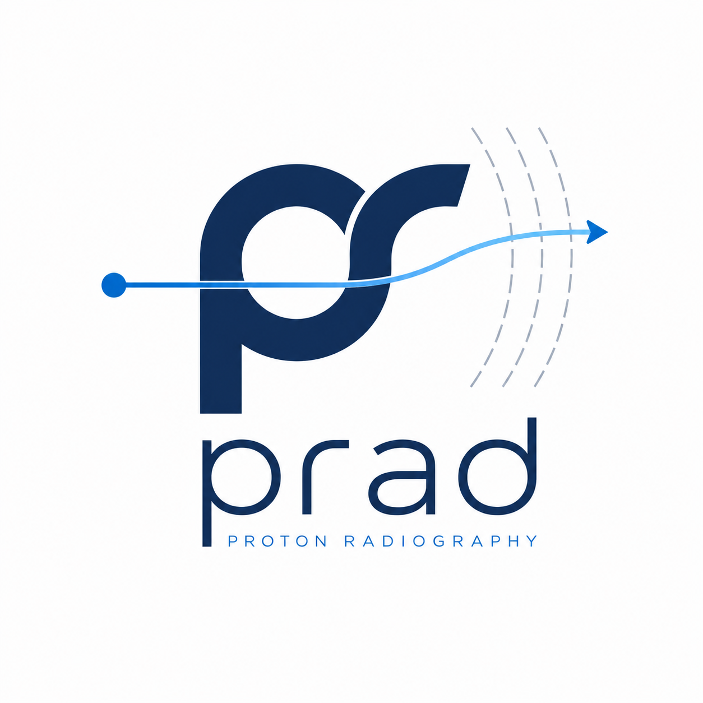
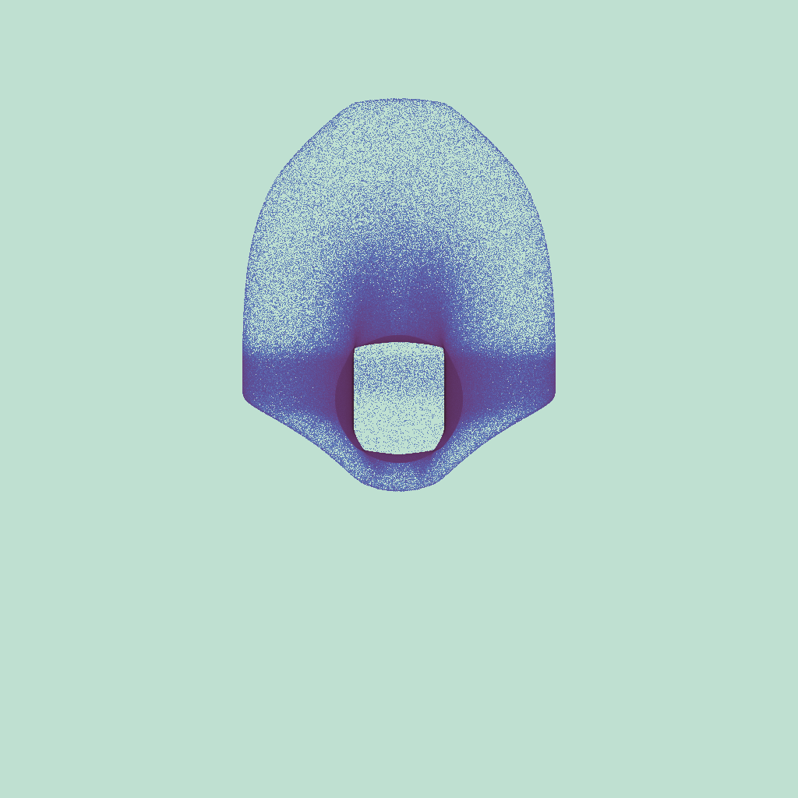
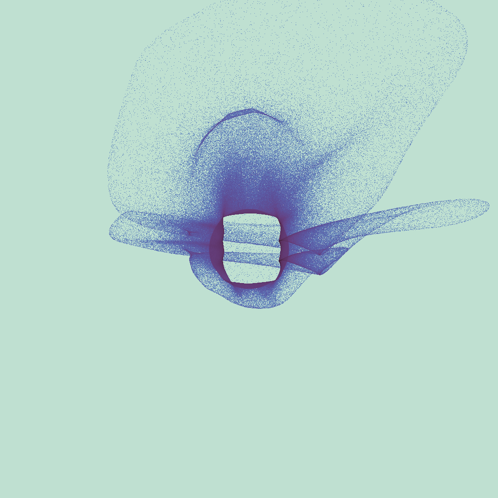
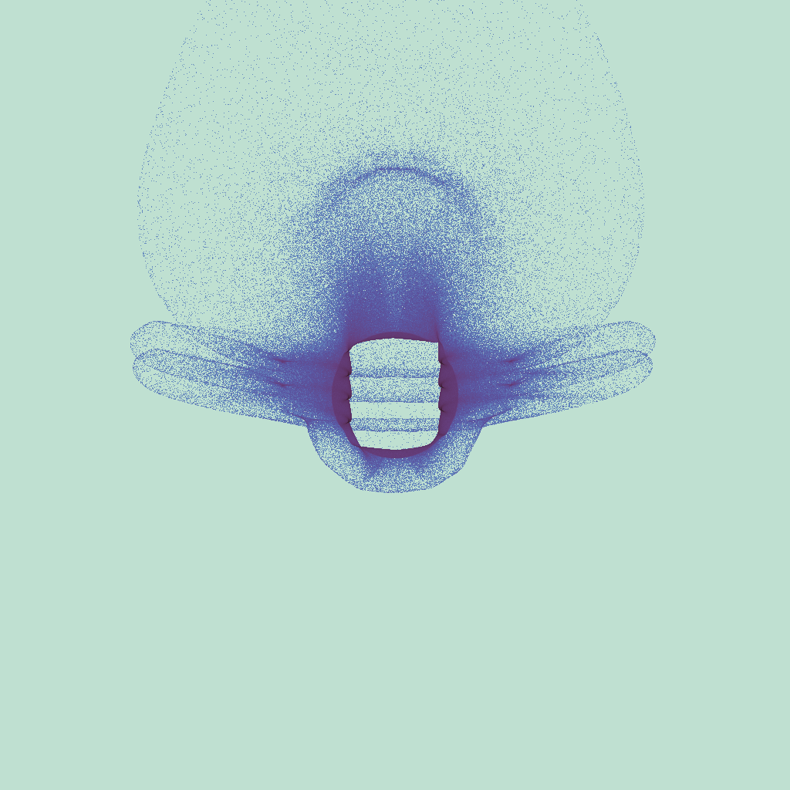
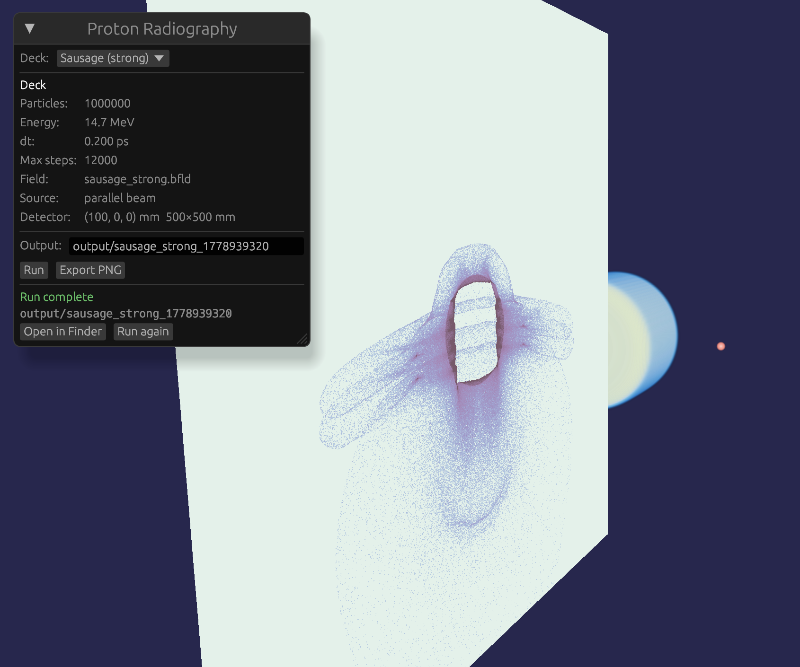

<p align="center">
  
</p>

**prad is a GPU-accelerated proton-radiography forward model for laser-plasma and HEDP experiments.**

Given a measured or simulated electromagnetic field, prad traces a synthetic proton beam
through it and produces a synthetic radiograph — the pattern of proton hits on the detector —
for direct comparison with experimental RCF or image-plate data.

It runs the full **relativistic Boris** orbit on the GPU. No paraxial approximation,
no non-relativistic shortcuts. 10⁶ particles end-to-end in under 2 seconds on a laptop GPU.

```
✓ 12/12 physics validation tests passing
✓ Reproducible, self-documenting run directories
✓ CLI + GUI workflows
✓ Python API (pip install prad)
✓ Re-render without re-tracing particles
```

## Tested platforms

| Platform | GPU | Backend | Status |
|---|---|---|---|
| macOS Apple Silicon | Apple M4 | MoltenVK/Vulkan | Validation suite passing; ~9 B steps/s peak |
| Ubuntu 22.04 Linux | NVIDIA RTX 4090 | NVIDIA Vulkan 1.3.277 | Validation suite passing; ~34 B steps/s peak |

---

## Example radiographs

Three MHD instability geometries, computed in seconds on a laptop GPU:

| z-pinch | kink instability | sausage instability |
|:---:|:---:|:---:|
|  |  |  |

Each image is a synthetic proton radiograph — the spatial structure directly reflects the
path-integrated field topology.

### GUI



Deck parameters, run status, and the 3D radiograph — all in one view.

---

## Why this tool

**Speed that changes what's practical.** The full-orbit Boris integrator runs 10⁶ particles
in under 2 seconds on a laptop GPU and under 0.5 seconds on an RTX 4090. In a matched
simplified particle-tracing test (10,000 particles, uniform field, single core), prad is
**214× faster** than a CPU Boris implementation via PlasmaPy — and GPU utilisation increases
further at larger particle counts. That gap makes workflows practical that previously weren't:
broad parameter sweeps, interactive geometry design, comparison of field topologies, synthetic
dataset generation for ML inverse solvers.

**No approximations.** Every fast alternative uses the paraxial approximation — it integrates
the field kick along a straight reference trajectory. That's fine for weak fields, but in the
strong-field regimes common in pulsed-power and high-intensity laser experiments it fails badly.
At just 20% of the kink instability field amplitude the paraxial prediction is qualitatively
wrong, producing streaks across the entire detector while the full-orbit result shows the
correct helical kink signature. prad traces the full relativistic orbit in all cases.

**A complete research environment.** prad is not just a solver. It ships with a Python API
(`pip install prad`, numpy arrays in and out), a parameter sweep engine, a GUI for interactive
deck editing, TNSA exponential spectrum sampling with exact inverse-CDF, and self-documenting
run directories with SHA-256 field hashes for exact reproducibility. You can go from a numpy
field array to a radiograph with three lines of Python, or run a six-point energy sweep from
the command line in one command.

---

## Prerequisites

| Dependency | Purpose | Install |
|---|---|---|
| Rust (stable) | Build the engine | `curl --proto '=https' --tlsv1.2 -sSf https://sh.rustup.rs \| sh` |
| `glslangValidator` | GLSL → SPIR-V shader compilation | `brew install glslang` |
| MoltenVK (macOS) | Vulkan over Metal | `brew install molten-vk` |
| Python 3.9+ | Validation suite, Python API | system or `pyenv` |

---

## Quick start

```bash
# Build (also compiles shaders via build.rs)
cd rust && cargo build --release && cd ..

# Scaffold a working deck from a preset
./rust/target/release/proton_tracer init zpinch -o my_run.toml

# Inspect resolved geometry before running
./rust/target/release/proton_tracer explain my_run.toml

# Schema check
./rust/target/release/proton_tracer validate my_run.toml

# Run — produces a self-contained output directory
./rust/target/release/proton_tracer run my_run.toml -o runs/zpinch_01
```

**macOS / MoltenVK** — set these before running:
```bash
export VK_ICD_FILENAMES=/opt/homebrew/etc/vulkan/icd.d/MoltenVK_icd.json
export DYLD_LIBRARY_PATH=/opt/homebrew/lib:$DYLD_LIBRARY_PATH
```

See [docs/quickstart.md](docs/quickstart.md) for the full install walkthrough.

---

## Python API

`prad` is a Python wrapper around the engine. Install it with pip:

```bash
pip install prad
```

Run a simulation and get results as numpy arrays in three lines:

```python
import prad

result = prad.run(
    "data/zpinch.bfld",
    energy_MeV=14.7,
    n_particles=200_000,
    source_distance_mm=80.0,
    detector_distance_mm=100.0,
)

counts = result.raw_counts          # numpy uint32, 1024×1024
print(result.diagnostics)           # hit_fraction, n_hits, …
result.show()                       # display inline (Jupyter / matplotlib)
```

You can also pass a field constructed from a numpy array directly:

```python
import numpy as np, prad

B = np.zeros((64, 64, 64, 3), dtype=np.float32)
B[:, :, :, 2] = 5.0                # 5 T uniform Bz

field = prad.Field.from_array(B, bounds_m=(-0.05, 0.05, -0.05, 0.05, -0.05, 0.05))
result = prad.run(field, n_particles=100_000)
```

See [docs/python_api.md](docs/python_api.md) for the full API reference.

---

## Subcommands

| Command | Purpose |
|---|---|
| `run <deck> [-o dir]` | Batch run — GPU compute, full run directory output |
| `gui [deck]` | Interactive launcher with live progress |
| `explain <deck>` | Print resolved geometry and step budget — no GPU |
| `validate <deck>` | Schema check only — no GPU |
| `init [preset] [-o deck.toml]` | Emit a starter deck (`blank` / `zpinch` / `kink-strong`) |
| `demo [preset]` | Run a built-in preset without writing a deck |
| `render <run_dir>` | Re-render radiograph from saved counts — no GPU |
| `sweep <deck> --param k=v1,v2` | Parameter sweep — one run directory per point |
| `inspect <run_dir\|sweep_dir>` | Print run or sweep summary |
| `analyze <run_dir>` | Count statistics |

---

## Run directory layout

Every `run` produces a self-contained directory. Share it with a colleague and they can
re-render or analyse without re-running anything.

```
runs/zpinch_01/
  input_deck.toml          ← exact copy of deck used
  resolved_config.json     ← fully resolved SI parameters
  metadata.json            ← hardware, git hash, field SHA-256, timing
  log.txt                  ← full terminal output mirror
  counts/
    raw_counts.bin         ← u32 [H×W] detector hit counts
    processed_counts.bin   ← f32 [H×W] after detector response
  images/
    radiograph.png
```

---

## Energy spectra

Three proton source spectra are supported:

| Mode | Deck field | Typical use |
|---|---|---|
| Monoenergetic | `energy_MeV` | D–³He fusion protons (14.7 MeV), accelerator beams |
| Gaussian spread | `energy_spread_percent` | Slightly impure mono sources, calibration |
| Exponential / TNSA | `temperature_MeV`, `cutoff_mev` | Laser-accelerated proton sources |

```toml
# TNSA example
[source]
temperature_MeV = 3.0
cutoff_mev      = 40.0
n_particles     = 200000
```

All three modes feed into the same relativistic Boris integrator — `u = γv` is computed
exactly regardless of the drawn energy. See [docs/spectra.md](docs/spectra.md) for details.

---

## Parameter sweeps

```bash
# Energy scan — four runs, zipped
proton_tracer sweep zpinch.toml \
  --param source.energy_MeV=5,10,15,20

# Range syntax
proton_tracer sweep zpinch.toml \
  --param source.energy_MeV=5:20:5

# Paired sweep — same-length lists, zipped
proton_tracer sweep zpinch.toml \
  --param source.energy_MeV=5,10,15 \
  --param numerics.max_steps=10000,20000,30000
```

Output: `runs/sweep_001/` with one run directory per point and a live `sweep_manifest.json`.

---

## Performance

Measured on Apple M4 (prad v0.3.1):

| Field | 100,000 particles | 1,000,000 particles |
|---|---|---|
| zero field | 0.34 s | 1.87 s |
| z-pinch | 0.31 s | 1.88 s |
| kink | 0.35 s | 1.92 s |
| sausage | 0.32 s | 1.91 s |

Peak step throughput: **9.0 B steps/s**.

**vs PlasmaPy** — in a matched simplified uniform-field particle-tracing benchmark
(10,000 particles, uniform Bz = 1 T, same geometry), prad's GPU backend is
214× faster than a single-core CPU Boris implementation via PlasmaPy. This comparison
isolates the forward particle-tracing step only; PlasmaPy is a broader plasma-physics
ecosystem and is not being replaced by prad.

| | PlasmaPy (CPU) | prad (GPU) |
|---|---|---|
| Wall time (10,000 particles) | 42.8 s | 0.20 s |
| Measured speedup | — | **214×** |

Additional Linux/NVIDIA validation on an RTX 4090 reached ~34 B particle-steps/s
on the benchmark configuration, corresponding to roughly ~2 M particles/s for
the tested step budget. See `benchmarks/validation/nvidia_rtx4090_ubuntu2204.txt`.

See [docs/benchmark.md](docs/benchmark.md) to reproduce these numbers.

---

## Validation

```bash
python3 validate.py           # uses existing binary
python3 validate.py --build   # build first, then validate
```

12 physics tests: B-only regression, zero-field straight-line projection, uniform E-field
deflection (sign and magnitude), relativistic Boris energy conservation (14.7000 MeV
recovered to sub-eV accuracy), pencil/point/disk source geometry, Gaussian energy spread,
exponential/TNSA spectrum (mean KE ≈ T, hard cutoff enforced), Gaussian blur, Poisson noise
reproducibility, and 60 MeV relativistic momentum initialisation (γ ≈ 1.064).

---

## Documentation

| Doc | Contents |
|---|---|
| [docs/quickstart.md](docs/quickstart.md) | Full install → first run walkthrough |
| [docs/python_api.md](docs/python_api.md) | Python API reference (`prad.run`, `Field`, `RunResult`) |
| [docs/geometry.md](docs/geometry.md) | Coordinate system, detector geometry, source types |
| [docs/spectra.md](docs/spectra.md) | Mono, Gaussian, and TNSA energy spectra |
| [docs/input_decks.md](docs/input_decks.md) | TOML schema, all fields, `--set` overrides |
| [docs/run_artifacts.md](docs/run_artifacts.md) | Run directory anatomy and reproducibility |
| [docs/file_formats.md](docs/file_formats.md) | `.bfld`, binary count formats, metadata schema |
| [docs/rendering.md](docs/rendering.md) | Counts → PNG pipeline, re-render without GPU |
| [docs/sweeps.md](docs/sweeps.md) | Parameter sweeps, syntax, sweep manifest |
| [docs/benchmark.md](docs/benchmark.md) | Throughput scaling, physics sanity cases, PlasmaPy comparison |
| [docs/validation.md](docs/validation.md) | Physics test descriptions and tolerances |
| [docs/gui.md](docs/gui.md) | Deck launcher workflow |
| [docs/limitations.md](docs/limitations.md) | Honest constraints and known gaps |

---

## License

MIT — see [LICENSE](LICENSE).

---

## Citation

If you use prad in published work, please cite:

```bibtex
@software{dolezal2026prad,
  author       = {Dolezal, Jonas},
  title        = {{prad}: {GPU}-accelerated relativistic proton radiography},
  year         = {2026},
  version      = {0.3.1},
  url          = {https://github.com/JonasDolezal07/gpu-proton-radiography},
  license      = {MIT},
}
```

A `CITATION.cff` file is also provided for automated citation tooling (GitHub "Cite this repository").
