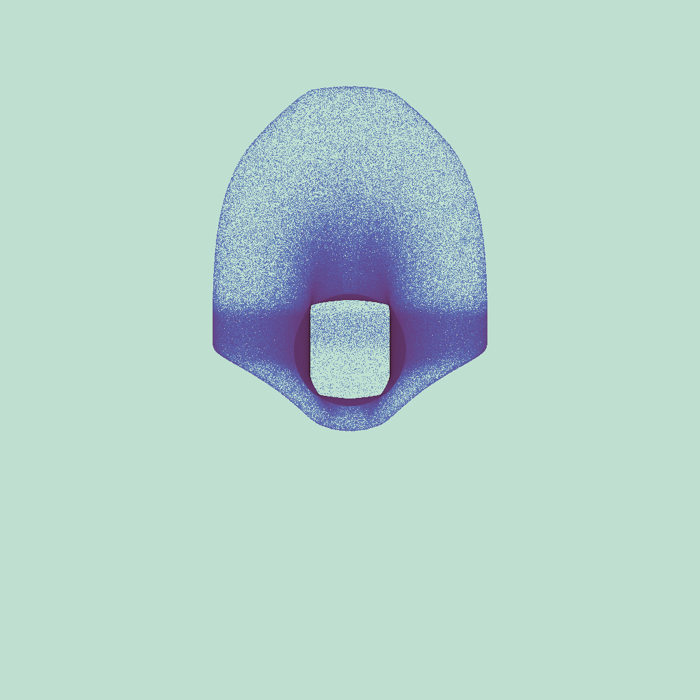
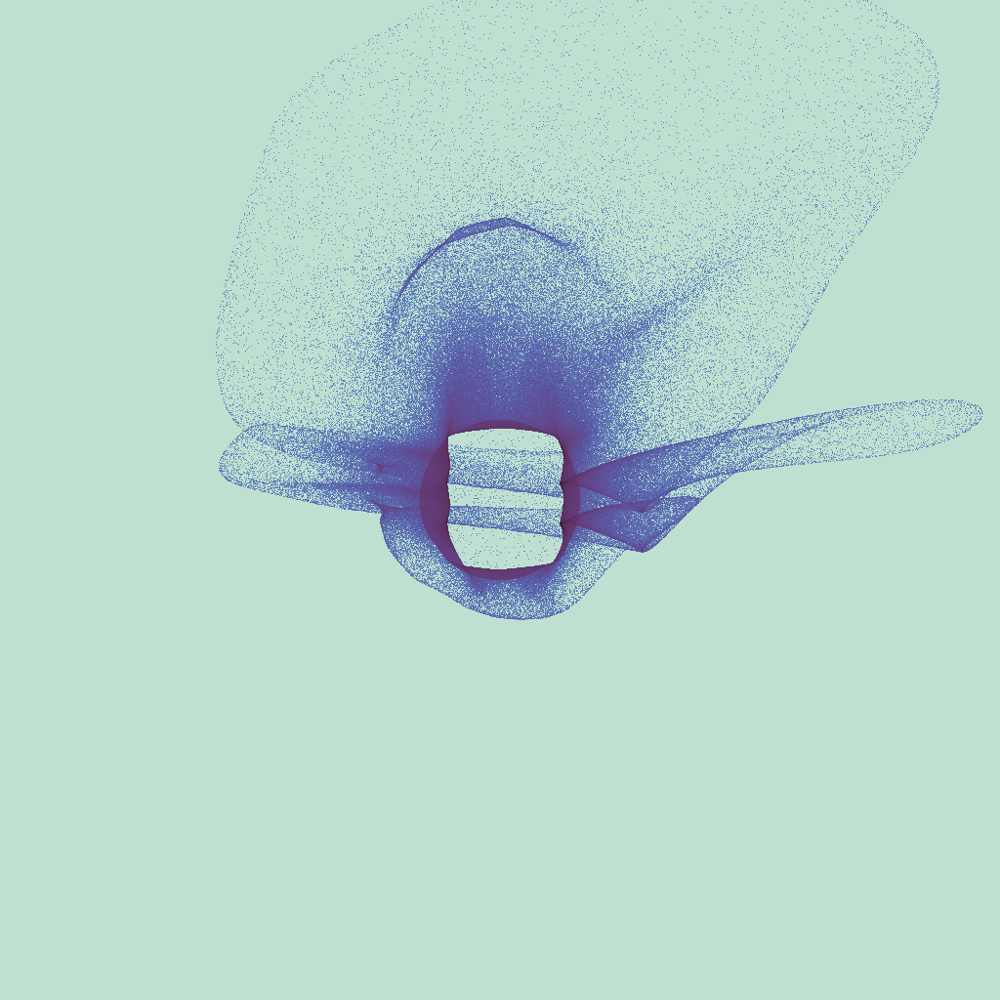
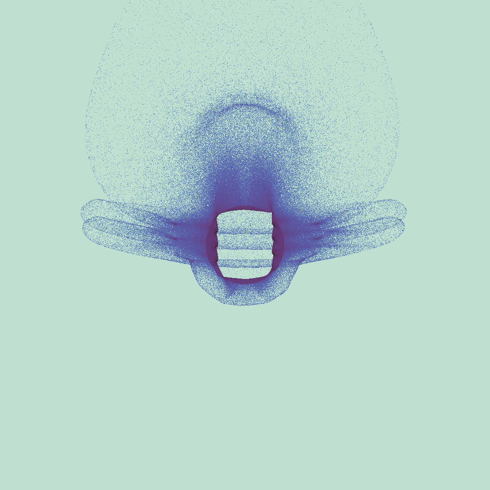
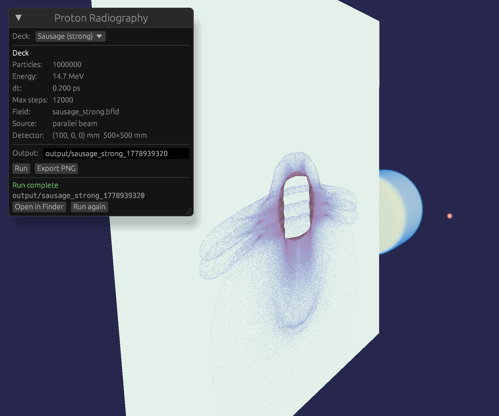

<p align="center">
  
</p>

**prad is a GPU-accelerated proton-radiography forward model for laser-plasma and HEDP experiments.**

Given a measured or simulated electromagnetic field, prad traces a synthetic proton beam through it
and produces a synthetic radiograph — the pattern of proton hits on the detector — for direct
comparison with experimental RCF or image-plate data. It runs the full **relativistic Boris** orbit,
no paraxial approximation, and is **≈33,000× faster than CPU tracing** in a measured 1M-particle
head-to-head against PlasmaPy on the same hardware.

```
✓ 25/25 physics validation tests passing (t01–t25)
✓ Trajectory-level agreement with PlasmaPy's CPU Boris pusher
✓ Reproducible, self-documenting run directories
✓ CLI + GUI workflows
✓ Python API (pip install prad)
✓ Re-render without re-tracing particles
```

---

## Quick start

| Dependency | Purpose | Install |
|---|---|---|
| Rust (stable) | Build the engine | `curl --proto '=https' --tlsv1.2 -sSf https://sh.rustup.rs \| sh` |
| `glslangValidator` | GLSL → SPIR-V shader compilation | `brew install glslang` |
| MoltenVK (macOS) | Vulkan over Metal | `brew install molten-vk` |
| Python 3.9+ | Validation suite, Python API | system or `pyenv` |

```bash
# Build (also compiles shaders via build.rs)
cd rust && cargo build --release && cd ..

# Scaffold a working deck from a preset
./rust/target/release/proton_tracer init zpinch -o my_run.toml

# Inspect resolved geometry before running
./rust/target/release/proton_tracer explain my_run.toml

# Run — produces a self-contained output directory
./rust/target/release/proton_tracer run my_run.toml -o runs/zpinch_01
```

**macOS / MoltenVK** — set these before running:
```bash
export VK_ICD_FILENAMES=/opt/homebrew/etc/vulkan/icd.d/MoltenVK_icd.json
export DYLD_LIBRARY_PATH=/opt/homebrew/lib:$DYLD_LIBRARY_PATH
```

See [docs/quickstart.md](docs/quickstart.md) for the full install walkthrough.

---

## Validation

```bash
python3 validate.py           # uses existing binary
python3 validate.py --build   # build first, then validate
```

25 physics tests covering electromagnetic deflection (analytic Larmor radius, E×B velocity
selector, relativistic energy conservation to machine precision), all source geometries and
energy spectra, arbitrary detector orientation, geometry invariance under world-frame rotation,
field compositing and linearity, adaptive timestepping, per-hit export consistency, and
Bethe-Bloch CSDA energy loss (0.7% vs NIST PSTAR). Trajectory-level physics agreement with
PlasmaPy's CPU Boris pusher is verified separately — see [docs/benchmark.md](docs/benchmark.md).

<details>
<summary>Latest run — Apple M4, macOS 15, MoltenVK (2026-06-12): <strong>25/25 PASS</strong></summary>

```
  test1_regression                     PASS
  test2_zero_fields                    PASS
  test3_uniform_E                      PASS
  test4_B_energy_conservation          PASS
  test5_pencil_tilted                  PASS
  test6_point_full_cone                PASS
  test7_disk_spatial_spread            PASS
  test8_energy_spread                  PASS
  test9_blur_conservation              PASS
  test10_poisson_reproducibility       PASS
  test11_exponential_spectrum          PASS
  test12_relativistic_60mev            PASS
  test13_tilted_geometry               PASS
  test14_superimposed_fields           PASS
  test15_adaptive_dt                   PASS
  test16_bethe_bloch                   PASS
  test17_analytic_hit                  PASS
  test18_larmor_radius                 PASS
  test19_exb_velocity_selector         PASS
  test20_hits_bin_rebinning            PASS
  test21_geometry_invariance           PASS
  test22_field_compositing_linearity   PASS
  test23_density_scaling               PASS
  test24_vacuum_regression             PASS
  test25_opaque_absorber               PASS
  ──────────────────────────────────────────
  25/25 PASS
```

</details>

See [docs/validation.md](docs/validation.md) for per-test descriptions and tolerances.

---

## Example radiographs

Three MHD instability geometries, computed in seconds on a laptop GPU:

| z-pinch | kink instability | sausage instability |
|:---:|:---:|:---:|
|  |  |  |

Each image is a synthetic proton radiograph — the spatial structure directly reflects the
path-integrated field topology.

### GUI



Deck parameters, run status, and the 3D radiograph — all in one view.

---

## Why this tool

**Speed that changes what's practical.** In a measured head-to-head against PlasmaPy's CPU
Boris pusher (uniform field, same laptop, both timed — no extrapolation), prad is
**≈2,180× faster at 1M particles with a matched fixed timestep**, and **≈33,000× faster**
with its default adaptive timestep (0.148 s vs 4,920 s). That gap makes workflows practical
that previously weren't: broad parameter sweeps, interactive geometry design, comparison of
field topologies, synthetic dataset generation for ML inverse solvers.

**No approximations.** Every fast alternative uses the paraxial approximation — it integrates
the field kick along a straight reference trajectory. That's fine for weak fields, but in the
strong-field regimes common in pulsed-power and high-intensity laser experiments it fails badly.
At just 20% of the kink instability field amplitude the paraxial prediction is qualitatively
wrong, producing streaks across the entire detector while the full-orbit result shows the
correct helical kink signature. prad traces the full relativistic orbit in all cases.

**A complete research environment.** prad is not just a solver. It ships with a Python API
(`pip install prad`, numpy arrays in and out), a parameter sweep engine, a GUI for interactive
deck editing, TNSA exponential spectrum sampling with exact inverse-CDF, and self-documenting
run directories with SHA-256 field hashes for exact reproducibility. You can go from a numpy
field array to a radiograph with three lines of Python, or run a six-point energy sweep from
the command line in one command.

---

## New in v0.4.0

- **Arbitrary source/detector geometry** — detector normal and up vectors are fully configurable; Gram-Schmidt basis construction in the shader handles any orientation (test 13)
- **Per-hit binary export** (`counts/hits.bin`) — every detector hit recorded as `(y_mm, z_mm, energy_MeV)`; enables energy-resolved radiographs and post-hoc material inference
- **Adaptive timestep** — large dt in vacuum, Larmor-constrained dt inside the field; 5–20× speedup with no physics change (test 15)
- **Superimposed field grids** — stack any number of `.bfld` files at load time via `[[field.extra_b]]` TOML blocks; CPU-side resampling, no shader changes (test 14)
- **Bethe-Bloch CSDA energy loss** — relativistic stopping power from a 256-entry GPU lookup table; scalar density grid (`.dens` format); material presets (water, CH₂, Be, Al, H); 0.7% agreement with NIST PSTAR at 14.7 MeV (test 16)

---

## Python API

`prad` is a Python wrapper around the engine. Install it with pip:

```bash
pip install prad
```

Run a simulation and get results as numpy arrays in three lines:

```python
import prad

result = prad.run(
    "data/zpinch.bfld",
    energy_MeV=14.7,
    n_particles=200_000,
    source_distance_mm=80.0,
    detector_distance_mm=100.0,
)

counts = result.raw_counts          # numpy uint32, 1024×1024
print(result.diagnostics)           # hit_fraction, n_hits, …
result.show()                       # display inline (Jupyter / matplotlib)
```

You can also pass a field constructed from a numpy array directly:

```python
import numpy as np, prad

B = np.zeros((64, 64, 64, 3), dtype=np.float32)
B[:, :, :, 2] = 5.0                # 5 T uniform Bz

field = prad.Field.from_array(B, bounds_m=(-0.05, 0.05, -0.05, 0.05, -0.05, 0.05))
result = prad.run(field, n_particles=100_000)
```

See [docs/python_api.md](docs/python_api.md) for the full API reference.

---

## Subcommands

| Command | Purpose |
|---|---|
| `run <deck> [-o dir]` | Batch run — GPU compute, full run directory output |
| `gui [deck]` | Interactive launcher with live progress |
| `explain <deck>` | Print resolved geometry and step budget — no GPU |
| `validate <deck>` | Schema check only — no GPU |
| `init [preset] [-o deck.toml]` | Emit a starter deck (`blank` / `zpinch` / `kink-strong`) |
| `demo [preset]` | Run a built-in preset without writing a deck |
| `render <run_dir>` | Re-render radiograph from saved counts — no GPU |
| `sweep <deck> --param k=v1,v2` | Parameter sweep — one run directory per point |
| `inspect <run_dir\|sweep_dir>` | Print run or sweep summary |
| `analyze <run_dir>` | Count statistics |

---

## Run directory layout

Every `run` produces a self-contained directory. Share it with a colleague and they can
re-render or analyse without re-running anything.

```
runs/zpinch_01/
  input_deck.toml          ← exact copy of deck used
  resolved_config.json     ← fully resolved SI parameters
  metadata.json            ← hardware, git hash, field SHA-256, timing
  log.txt                  ← full terminal output mirror
  counts/
    raw_counts.bin         ← u32 [H×W] detector hit counts
    processed_counts.bin   ← f32 [H×W] after detector response
    hits.bin               ← (y_mm, z_mm, energy_MeV) per hit
  images/
    radiograph.png
```

---

## Energy spectra

Three proton source spectra are supported:

| Mode | Deck field | Typical use |
|---|---|---|
| Monoenergetic | `energy_MeV` | D–³He fusion protons (14.7 MeV), accelerator beams |
| Gaussian spread | `energy_spread_percent` | Slightly impure mono sources, calibration |
| Exponential / TNSA | `temperature_MeV`, `cutoff_mev` | Laser-accelerated proton sources |

```toml
# TNSA example
[source]
temperature_MeV = 3.0
cutoff_mev      = 40.0
n_particles     = 200000
```

All three modes feed into the same relativistic Boris integrator — `u = γv` is computed
exactly regardless of the drawn energy. See [docs/spectra.md](docs/spectra.md) for details.

---

## Parameter sweeps

```bash
# Energy scan — four runs, zipped
proton_tracer sweep zpinch.toml \
  --param source.energy_MeV=5,10,15,20

# Range syntax
proton_tracer sweep zpinch.toml \
  --param source.energy_MeV=5:20:5

# Paired sweep — same-length lists, zipped
proton_tracer sweep zpinch.toml \
  --param source.energy_MeV=5,10,15 \
  --param numerics.max_steps=10000,20000,30000
```

Output: `runs/sweep_001/` with one run directory per point and a live `sweep_manifest.json`.

---

## Performance

**vs PlasmaPy** — measured head-to-head on the same hardware (uniform Bz = 1 T, 14.7 MeV
protons, Apple M4; both tracers timed at every point, no extrapolation). With a matched fixed
timestep (dt = 0.2 ps, identical physics) prad is **≈2,180× faster at 1M particles**. With
prad's default three-phase adaptive timestep — large dt in vacuum, Larmor-constrained dt
inside the field — the measured gap is:

| N | prad (adaptive dt) | PlasmaPy (measured) | Speedup |
|---|---|---|---|
| 100,000 | 0.076 s | 425 s | **≈ 5,600×** |
| 500,000 | 0.114 s | 2,332 s | **≈ 20,400×** |
| 1,000,000 | 0.148 s | 4,920 s | **≈ 33,000×** |

This comparison isolates the forward particle-tracing step only; PlasmaPy is a broader
plasma-physics ecosystem and is not being replaced by prad.

Fixed-dt wall times per field preset (Apple M4, prad v0.4.0):

| Field | 100,000 particles | 1,000,000 particles |
|---|---|---|
| zero field | 0.34 s | 1.87 s |
| z-pinch | 0.31 s | 1.88 s |
| kink | 0.35 s | 1.92 s |
| sausage | 0.32 s | 1.91 s |

Peak step throughput: **9.0 B steps/s**.

Additional Linux/NVIDIA validation on an RTX 4090 reached ~34 B particle-steps/s
on the benchmark configuration, corresponding to roughly ~2 M particles/s for
the tested step budget. See `benchmarks/validation/nvidia_rtx4090_ubuntu2204.txt`.

See [docs/benchmark.md](docs/benchmark.md) to reproduce these numbers.

---

## Tested platforms

| Platform | GPU | Backend | Status |
|---|---|---|---|
| macOS Apple Silicon | Apple M4 | MoltenVK/Vulkan | Validation suite passing; ~9 B steps/s peak |
| Ubuntu 22.04 Linux | NVIDIA RTX 4090 | NVIDIA Vulkan 1.3.277 | Validation suite passing; ~34 B steps/s peak |

---

## Documentation

| Doc | Contents |
|---|---|
| [docs/quickstart.md](docs/quickstart.md) | Full install → first run walkthrough |
| [docs/python_api.md](docs/python_api.md) | Python API reference (`prad.run`, `Field`, `RunResult`) |
| [docs/geometry.md](docs/geometry.md) | Coordinate system, detector geometry, source types, tilted geometry |
| [docs/spectra.md](docs/spectra.md) | Mono, Gaussian, and TNSA energy spectra |
| [docs/input_decks.md](docs/input_decks.md) | TOML schema, all fields, `--set` overrides |
| [docs/adaptive_timestep.md](docs/adaptive_timestep.md) | Three-phase adaptive dt schedule, speedup, config |
| [docs/field_compositing.md](docs/field_compositing.md) | Superimposing multiple `.bfld` grids at load time |
| [docs/stopping_power.md](docs/stopping_power.md) | Bethe-Bloch CSDA energy loss, `.dens` format, material presets |
| [docs/run_artifacts.md](docs/run_artifacts.md) | Run directory anatomy and reproducibility |
| [docs/file_formats.md](docs/file_formats.md) | `.bfld`, `.dens`, `hits.bin`, binary count formats, metadata schema |
| [docs/rendering.md](docs/rendering.md) | Counts → PNG pipeline, re-render without GPU |
| [docs/sweeps.md](docs/sweeps.md) | Parameter sweeps, syntax, sweep manifest |
| [docs/benchmark.md](docs/benchmark.md) | Throughput scaling, physics sanity cases, PlasmaPy comparison |
| [docs/validation.md](docs/validation.md) | Physics test descriptions and tolerances (25 tests) |
| [docs/convergence.md](docs/convergence.md) | Numerical robustness and convergence studies |
| [docs/gui.md](docs/gui.md) | Deck launcher workflow |
| [docs/limitations.md](docs/limitations.md) | Honest constraints and known gaps |

---

## License

MIT — see [LICENSE](LICENSE).

---

## Citation

If you use prad in published work, please cite:

```bibtex
@software{dolezal2026prad,
  author       = {Dolezal, Jonas},
  title        = {{prad}: {GPU}-accelerated relativistic proton radiography},
  year         = {2026},
  version      = {0.4.0},
  url          = {https://github.com/JonasDolezal07/gpu-proton-radiography},
  license      = {MIT},
}
```

A `CITATION.cff` file is also provided for automated citation tooling (GitHub "Cite this repository").
