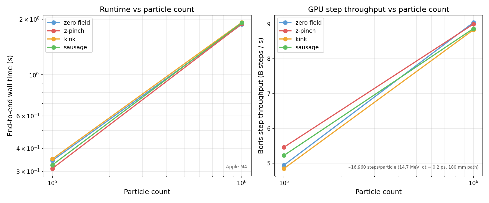
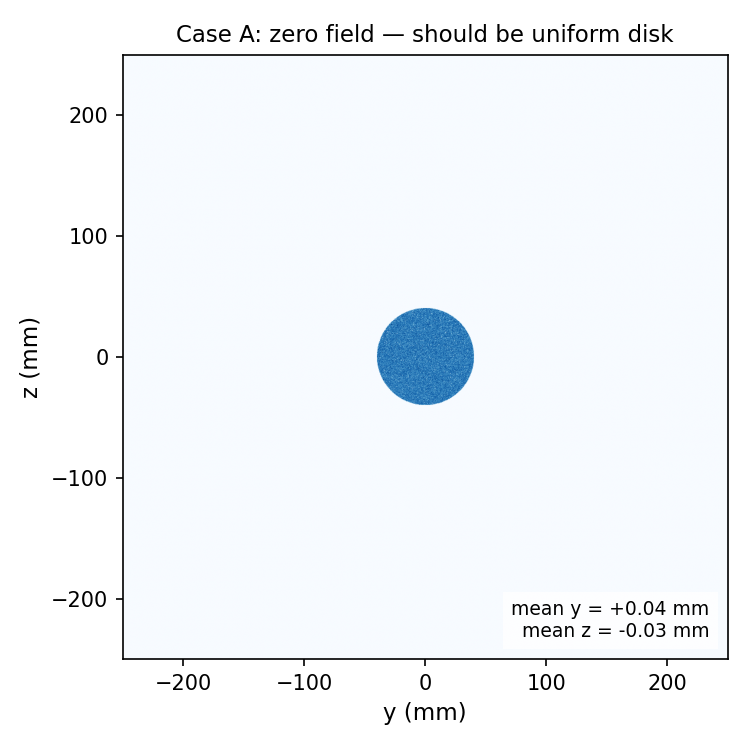
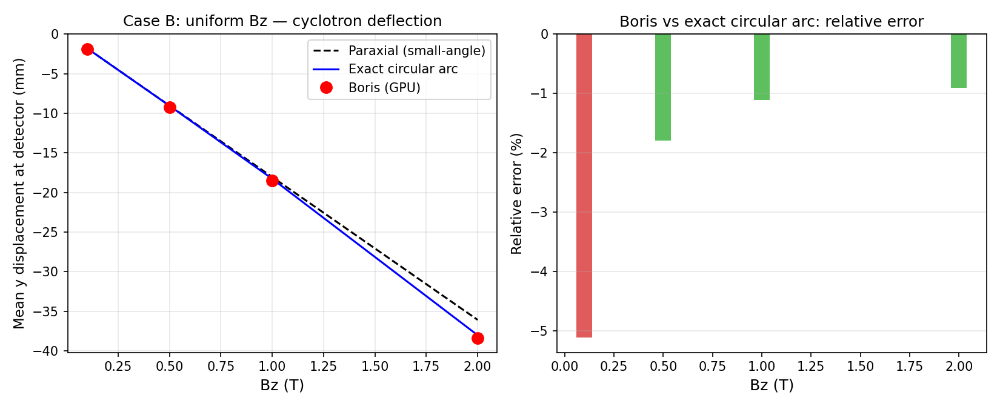
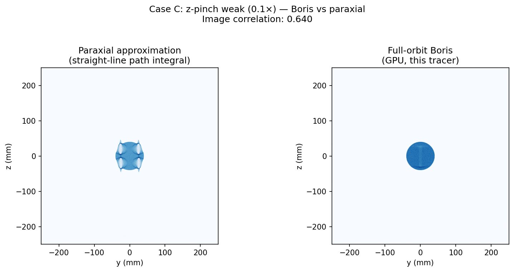
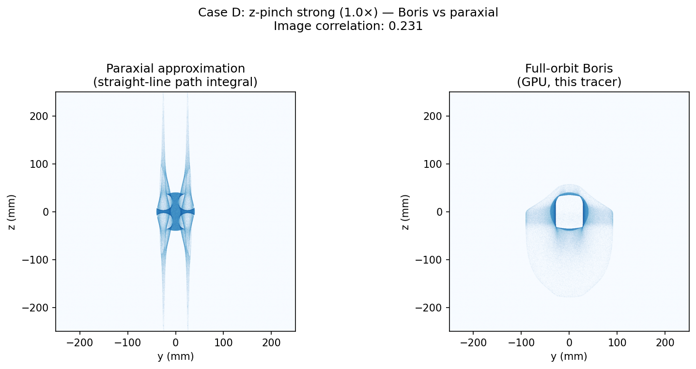
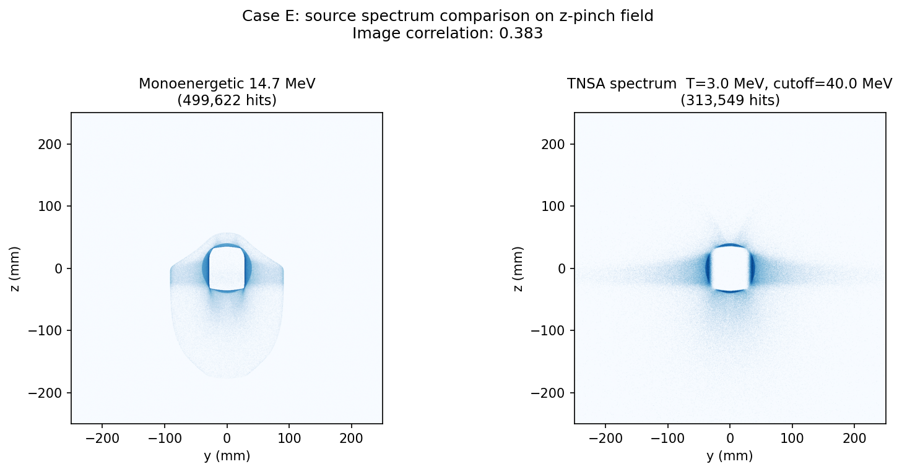
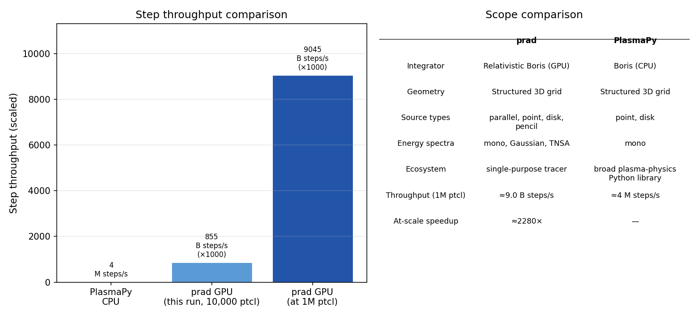

# Benchmark

> Generated by `python3 benchmarks/plot.py`.
> Refresh data: `python3 benchmarks/run_perf.py && python3 benchmarks/run_physics.py`

---

## 1. Summary

| | |
|---|---|
| Hardware | **Apple M4** |
| prad version | **0.3.0** |
| Validation | **12 / 12 tests passing** |
| Integrator | Relativistic Boris (u = γv) |

---

## 2. Throughput scaling

GPU wall time and step throughput across four field types.



### Timing table

| Field | 100,000 | 1,000,000 |
|---|---|---|
| zero field | 0.34 s | 1.87 s |
| z-pinch | 0.31 s | 1.88 s |
| kink | 0.35 s | 1.92 s |
| sausage | 0.32 s | 1.91 s |

Wall time in seconds.

Peak throughput: **0.53 Mparticles/s** (Apple M4)

---

## 3. Physics sanity cases

These cases check that the Boris integrator reproduces analytically known results.

### Case A — Zero field: straight-line projection

With no electromagnetic field, protons travel in straight lines.
The hit distribution should be a uniform disk centred within 2 mm of the detector centre.

| Metric | Value |
|---|---|
| Mean y | +0.04 mm |
| Mean z | -0.03 mm |
| Std y  | 20.0 mm |
| Std z  | 20.0 mm |
| Centring (< 2 mm) | **pass** |



### Case B — Uniform Bz: cyclotron deflection

Protons crossing a uniform transverse B field undergo a lateral displacement.
The exact prediction (circular arc inside slab + straight drift to detector) is:

```
R   = p / (q Bz)          cyclotron radius
φ   = arcsin(L / R)       arc angle through slab
Δy  = −R(1 − cos φ) − tan(φ) × lever_arm
```

where L = 0.10 m is the field slab length and lever_arm = 0.05 m.

| Bz (T) | Boris (mm) | Exact circ arc (mm) | Paraxial (mm) | Error vs exact |
|---|---|---|---|---|
| 0.1 | -1.90 | -1.81 | -1.81 | -5.1% |
| 0.5 | -9.22 | -9.05 | -9.03 | -1.8% |
| 1.0 | -18.48 | -18.28 | -18.05 | -1.1% |
| 2.0 | -38.38 | -38.04 | -36.10 | -0.9% |



---

## 4. Full-orbit vs paraxial behaviour

The paraxial approximation integrates B⊥ along the unperturbed straight-line path.
It is exact in the small-deflection limit and fails in strong structured fields.

### Case C — Weak z-pinch (scale\_B = 0.1×)

At 10% field strength, deflections are moderate.
Boris and paraxial agree reasonably but not perfectly.

**Image correlation Boris vs paraxial: 0.640**  |  95th-percentile |θ|: 10.7°



### Case D — Strong z-pinch (scale\_B = 1.0×)

At full field strength, particles undergo large deflections. Caustic arcs form in
the full-orbit radiograph that the paraxial approximation cannot reproduce.

**Image correlation Boris vs paraxial: 0.231**  |  95th-percentile |θ|: 106.6°



---

## 5. Source spectra

### Case E — Monoenergetic vs TNSA-like spectrum

Same z-pinch field, same geometry, different proton source spectra.

| | Mono | TNSA-like |
|---|---|---|
| Distribution | Single energy | Exponential dN/dE ∝ exp(−E/T) |
| Energy / T | 14.7 MeV | T = 3.0 MeV, cutoff = 40 MeV |
| Max steps | 25,000 | 80,000 (low-energy particles need more steps) |
| Detector hits | 499,622 / 500,000 | 313,549 / 500,000 |
| Image correlation | 1.000 | 0.383 vs mono |

The TNSA spectrum shifts the hit distribution because low-energy particles
are deflected more strongly by the z-pinch field.
The broad energy range also smears sharp caustic features visible in the mono image.



---

## 6. PlasmaPy comparison

!!! note "Scope"
    This comparison is **not** a claim that prad replaces PlasmaPy.
    PlasmaPy provides a broader scientific Python plasma-physics ecosystem.
    The benchmark isolates the proton-radiography forward-model step and compares
    PlasmaPy's CPU Boris integrator against prad's GPU full-orbit tracer under
    matched simplified conditions (uniform Bz, monoenergetic protons, same geometry).

Test conditions: 10,000 particles, uniform Bz = 1 T, E = 14.7 MeV, dt = 0.2 ps, ≈ 16,960 steps/particle.

| | PlasmaPy (CPU) | prad (GPU) |
|---|---|---|
| Wall time (10,000 particles) | 42.8 s | 0.20 s |
| Step throughput | 4.0 M steps/s | 0.86 B steps/s |
| At-scale speedup (1M particles) | — | ≈2280× faster |



**What this means in practice:**  For a parameter sweep of 20 configurations
× 200,000 particles, prad completes in under a minute on a laptop GPU.
The same sweep would take several hours with PlasmaPy on a single CPU core.

**What prad does not provide:** PlasmaPy includes MHD field solvers,
plasma diagnostic tools, and a much broader scientific Python ecosystem.
prad is a single-purpose GPU radiography forward model.

---

## 7. Reproduce

```bash
# Run benchmarks (requires built binary)
python3 benchmarks/run_perf.py
python3 benchmarks/run_physics.py

# (Optional) PlasmaPy comparison — requires: pip install plasmapy
python3 benchmarks/run_plasmapy.py

# Regenerate plots and this page
python3 benchmarks/plot.py
```

All results are written to `benchmarks/results/` (gitignored).
Plots are written to `docs/images/benchmark/` and committed to the repository.
