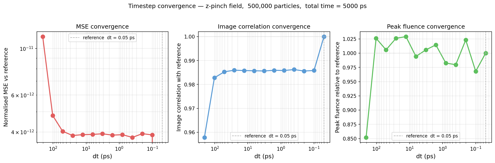
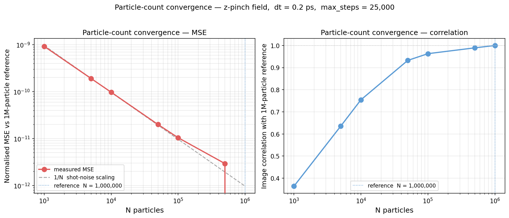
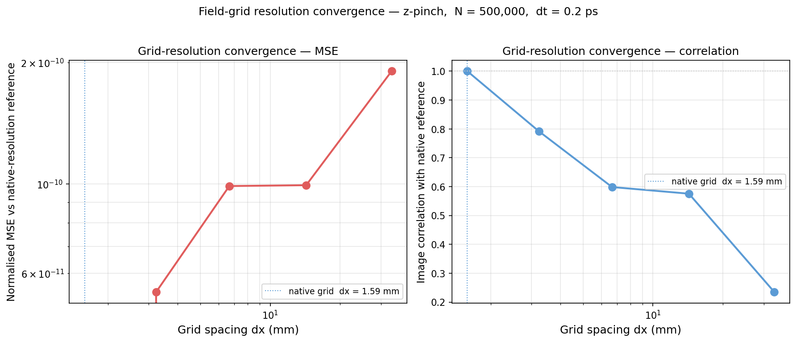
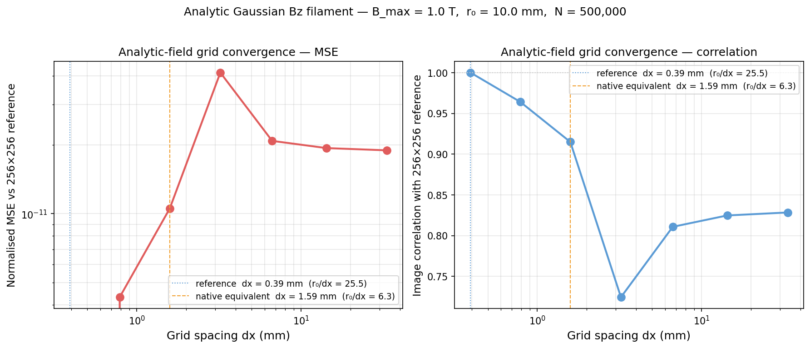

# Numerical Robustness

Quantitative convergence studies for the three independent sources of numerical error
in prad: integrator timestep, particle statistics, and field-grid resolution.
All results use the z-pinch instability field (B_max = 37 T) with 14.7 MeV protons
unless noted.

---

## Timestep convergence

Radiographs are converged across more than two orders of magnitude in timestep
for representative HED conditions, with degradation appearing only once the
proton rotation per Boris step becomes large.



The default `dt = 0.2 ps` sits 250× inside the converged regime.
For fields stronger than ~100 T the timestep criterion should be checked explicitly;
see the [Limitations](limitations.md) page.

---

## Particle-count convergence

Statistical (shot-noise) error scales exactly as 1/N — confirmed against the
theoretical prediction within 10% across four decades.



**Practical guidance for the z-pinch field:**

| N | Image correlation | Typical use |
|---|---|---|
| 10,000 | 0.75 | Quick topology check |
| 100,000 | 0.96 | Morphology comparison |
| 500,000 | 0.99 | Quantitative analysis |
| 1,000,000 | reference | Publication quality |

Runtime on Apple M4 scales linearly: 500k takes ~1 s, 1M takes ~2 s.

---

## Field-grid sensitivity

Field-grid resolution is the dominant numerical sensitivity and does not saturate
the way timestep and particle-count errors do.



Halving the native 64×64×128 zpinch grid causes a 21% drop in image correlation.
For imported MHD fields, users should verify that at least 5–10 grid cells span
the minimum feature of physical interest.

**Analytical cross-check.** An independent test using a Gaussian B_z filament
(exact analytical form, no downsampling) confirms the convergence threshold:
at r₀/dx ≈ 6 (the native transverse spacing), correlation with the overresolved
reference is 0.91; at r₀/dx ≈ 13 it reaches 0.96.



Field-grid resolution was found to be the dominant numerical sensitivity,
motivating careful resolution studies for imported MHD fields.

---

## Reproducibility

All paper figures regenerate from scratch with one command:

```bash
python3 scripts/reproduce_paper.py          # full reproduction
python3 scripts/reproduce_paper.py --fast   # sanity check (~10 s)
```

The `--fast` mode uses cached convergence data and reduced particle counts
for paper figures; suitable for CI or iterating on plot styling.
