# Validation

## Running the suite

```bash
python3 validate.py           # uses existing binary
python3 validate.py --build   # cargo build --release first, then validate
```

Current status: **24/24 passing**.

Output: `output/validation/` (per-test run directories) and `output/validation_report.json`.

---

## Test summary

| # | Name | Purpose | What it validates |
|---|------|---------|-------------------|
| 1 | B-only regression | zpinch preset smoke test | Core Boris + B-field path has not regressed |
| 2 | Zero fields | Straight-line projection | No spurious deflection when E = B = 0 |
| 3 | Uniform E only | Sign and magnitude | E-field force has correct sign and order of magnitude |
| 4 | B-only energy conservation | Magnetic force does no work | Relativistic Boris conserves KE to < 0.01% RMS |
| 5 | Pencil source, 2° tilt | Off-axis pencil geometry | Source direction → detector hit position |
| 6 | Point source, full cone | Wide-angle emission | Point source geometry and full-detector illumination |
| 7 | Disk source spatial spread | Source size magnification | Disk radius maps to correct spread at detector |
| 8 | Energy spread | Gaussian sampling | Energy spread applied with correct σ |
| 9 | Blur conservation | Detector response PSF | Blur redistributes counts without loss |
| 10 | Poisson noise reproducibility | Noise seeding | Same seed → identical output; different seed → differs |
| 11 | Exponential spectrum | TNSA energy distribution | Inverse-CDF sampler and hard cutoff |
| 12 | Relativistic 60 MeV | γ ≈ 1.064 regime | Correct u = γv momentum initialisation |
| 13 | Tilted detector geometry | Arbitrary source/detector orientation | Gram-Schmidt basis, signed-distance plane crossing |
| 14 | Superimposed fields equal sum | Field compositing | Composite field equals standalone field everywhere |
| 15 | Adaptive dt matches fixed dt | Adaptive timestep | Phase-boundary switching introduces no systematic error |
| 16 | Bethe-Bloch energy loss | 1 mm water slab | GPU CSDA matches analytic integral to < 5% |
| 17 | Analytic straight-line hit | Off-axis ray–plane intersection | Hit coordinates match analytic projection to 0.1 mm |
| 18 | Larmor radius | Analytic cycloid vs Boris | Relativistic deflection angle matches closed-form helix to 1% |
| 19 | E×B velocity selector | Force balance: E_y = v·B_z | Electric and magnetic forces cancel; beam goes straight |
| 20 | hits.bin rebinning | Per-hit export consistency | Python histogram of hits.bin reproduces GPU raw_counts.bin |
| 21 | Geometry invariance | 90° world-frame rotation | Local deflection is identical regardless of beam orientation |
| 22 | Field compositing linearity | Orthogonal B superposition | Bz and By channels deflect independently; cross-coupling < 5% |
| 23 | Density scaling | ΔE ∝ ρL; ρL equivalence | Three slabs: energy loss scales with column depth, not density alone |
| 24 | Vacuum regression | No `[density]` block | Bethe-Bloch path is a no-op when density is absent |

---

## Test descriptions

### Test 1 — B-only regression

Runs the zpinch preset (`data/instabilities/zpinch.json`) and asserts ≥ 10,000 detector hits.

Verifies that the core relativistic Boris + B-field path has not regressed. Also checks
that PNG, raw\_counts.bin, and processed\_counts.bin are produced with correct sizes.

<figure markdown>
  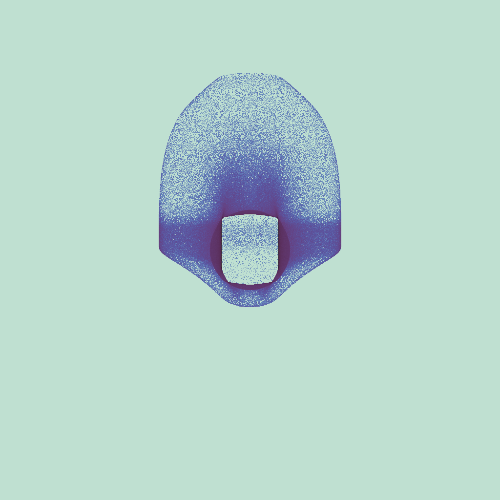
  <figcaption>Test 1 — z-pinch instability. Axial compression produces a bright central caustic flanked by deflection halos.</figcaption>
</figure>

---

### Test 2 — Zero fields, straight-line projection

B = E = 0. Protons travel straight. Asserts that the mean hit position is within ±1 mm of
the detector centre in both y and z.

Catches sign errors in the integrator or coordinate mapping that would cause systematic deflection
in the absence of fields.

<figure markdown>
  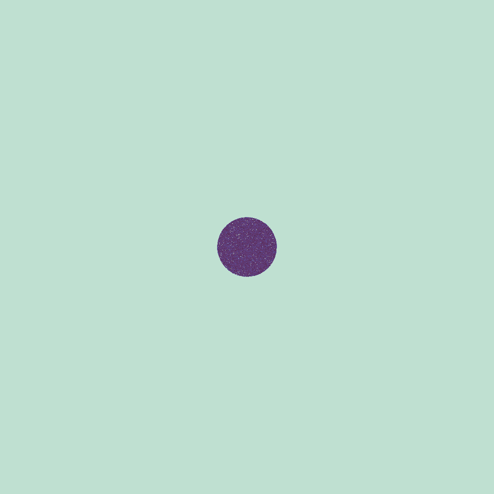
  <figcaption>Test 2 — zero field, parallel beam. Uniform disk centred on the detector; no deflection.</figcaption>
</figure>

---

### Test 3 — Uniform E only, sign and magnitude

B = 0, Ey = +10 MV/m everywhere. Protons (positive charge) must deflect in +y. Asserts:

- mean hit y > 0 (correct sign)
- magnitude is within a factor of 3 of the non-relativistic analytical estimate

<figure markdown>
  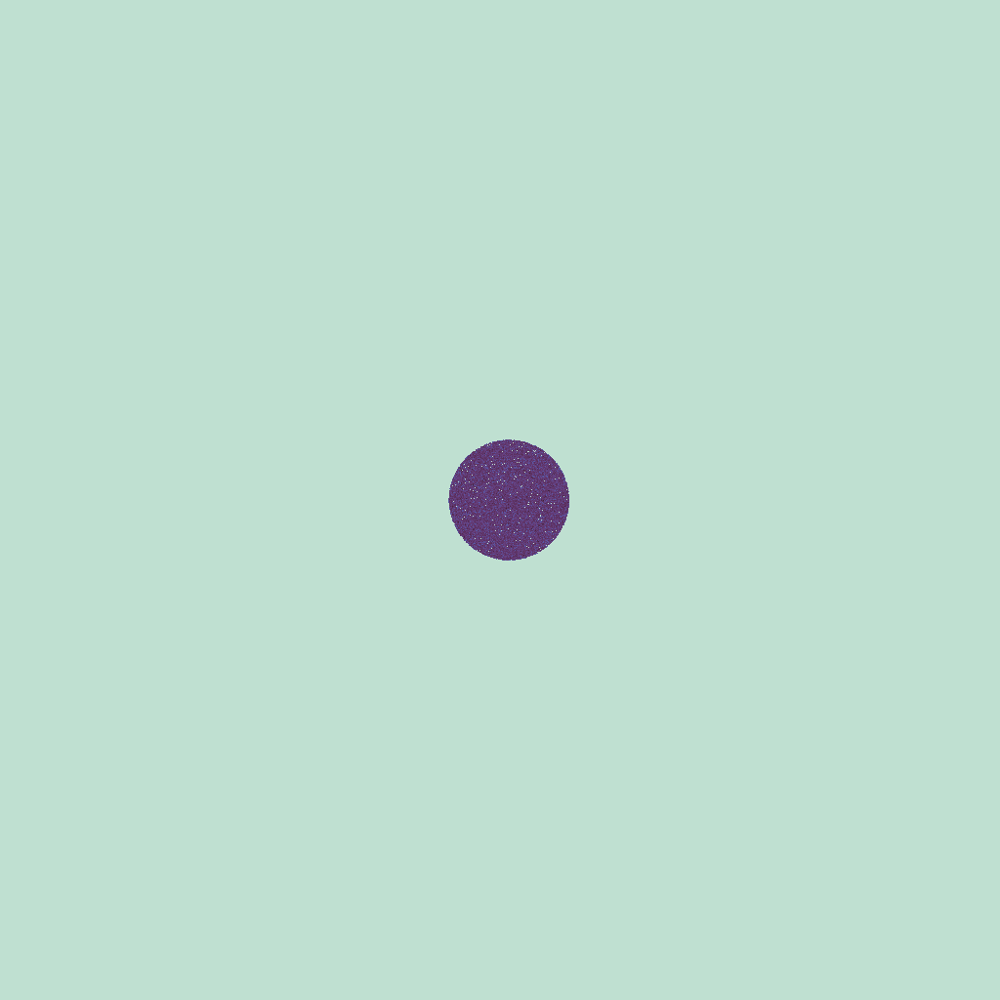
  <figcaption>Test 3 — uniform E_y. Beam deflects upward (+y) as expected for positive charge in a positive E_y field.</figcaption>
</figure>

---

### Test 4 — Uniform B only, energy conservation

B = Bz everywhere, E = 0. The relativistic Boris integrator must conserve kinetic energy
exactly in a pure magnetic field (magnetic force does no work — the rotation preserves `|u|`
to machine precision). Asserts that the RMS fractional energy deviation across all particles
is < 0.01%.

Result: std/mean = 6.5 × 10⁻⁸ (numerical precision floor only).

<figure markdown>
  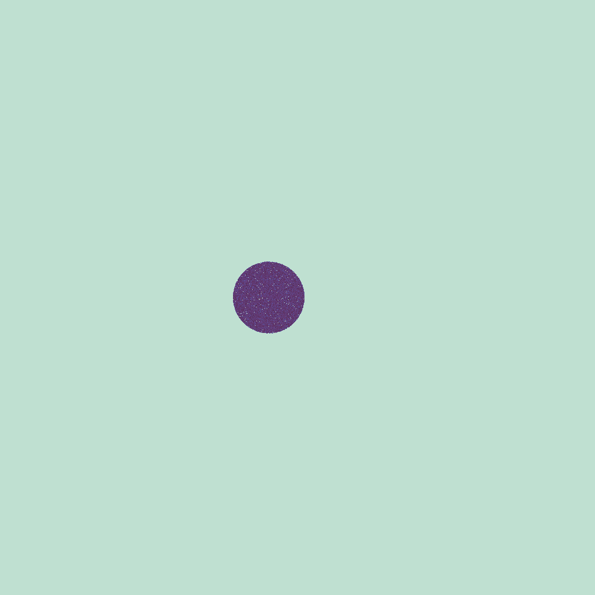
  <figcaption>Test 4 — uniform B_z, pencil beam. Spot deflects in −y (Lorentz force). Exit KE is identical to input to < 0.01%.</figcaption>
</figure>

---

### Test 5 — Pencil source, 2° tilt, zero field

A pencil beam aimed at 2° off-axis in zero field. Asserts that the mean hit position
corresponds to the expected geometric deflection at the detector plane.

<figure markdown>
  
  <figcaption>Test 5 — zero field, 3mm parallel display beam. Actual test validates pencil beam direction via hit position. 30 mm display detector.</figcaption>
</figure>

---

### Test 6 — Point source, cone covers full detector

A point source with a wide cone angle. Asserts that hits are distributed across the full
detector area and that the hit fraction exceeds a minimum threshold.

<figure markdown>
  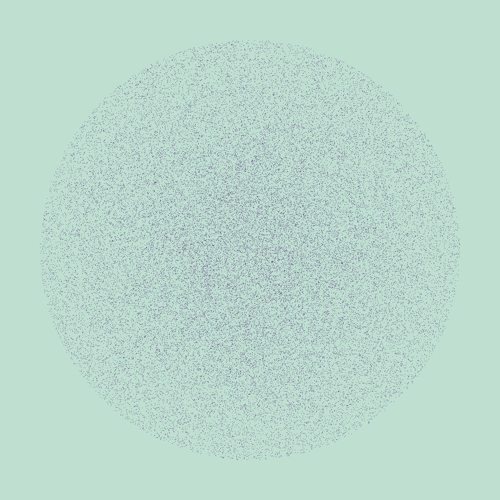
  <figcaption>Test 6 — point source, wide cone. Uniform illumination of the full detector area confirms emission geometry and solid-angle sampling.</figcaption>
</figure>

---

### Test 7 — Disk source, spatial spread matches radius

A disk source with known `radius_um`. In zero field, the spatial spread of hits on the
detector must match the magnified source radius within 10%.

<figure markdown>
  
  <figcaption>Test 7 — disk source, zero field. The circular footprint on the detector matches the geometrically magnified source radius.</figcaption>
</figure>

---

### Test 8 — Energy spread

A source with `energy_spread_percent > 0`. Asserts that the distribution of hit kinetic
energies matches a Gaussian with the expected standard deviation.

<figure markdown>
  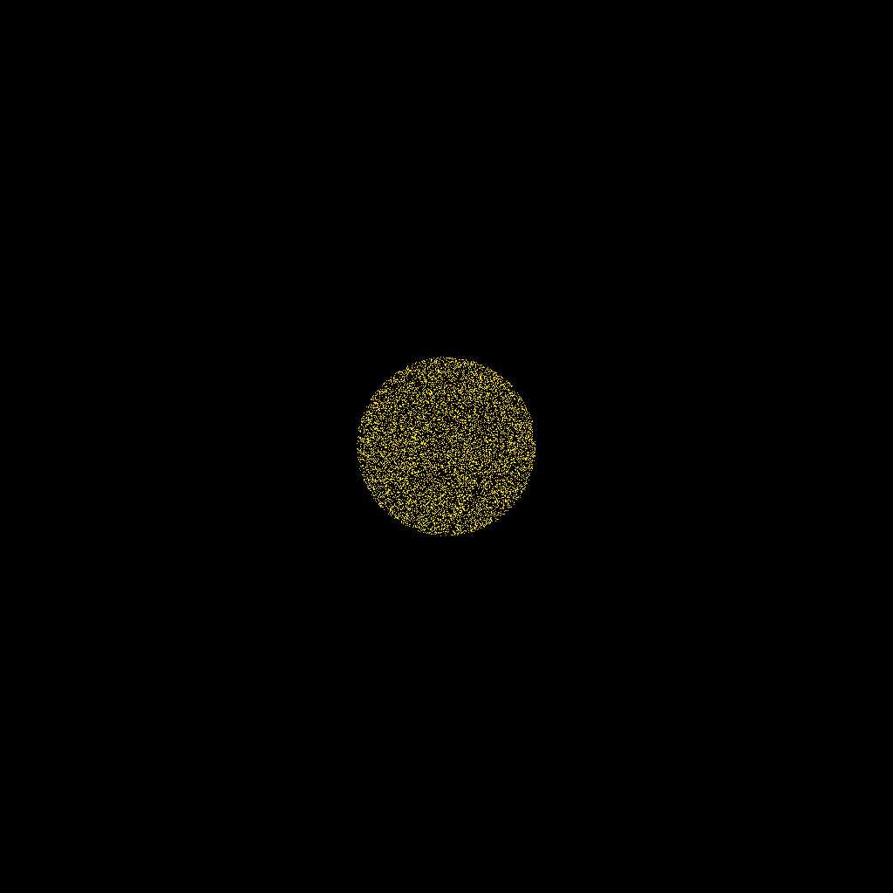
  <figcaption>Test 8 — Gaussian energy spread, zero field. 3mm parallel display beam; the physics check is on the KE distribution in hits.bin. 30 mm display detector.</figcaption>
</figure>

---

### Test 9 — Gaussian blur, count conservation and spot widening

Applies detector blur (`blur_sigma_um`) to a pencil-like source. Asserts:

- total counts are conserved (blur redistributes, not removes, particles)
- the spatial spread of processed counts is wider than raw counts

<figure markdown>
  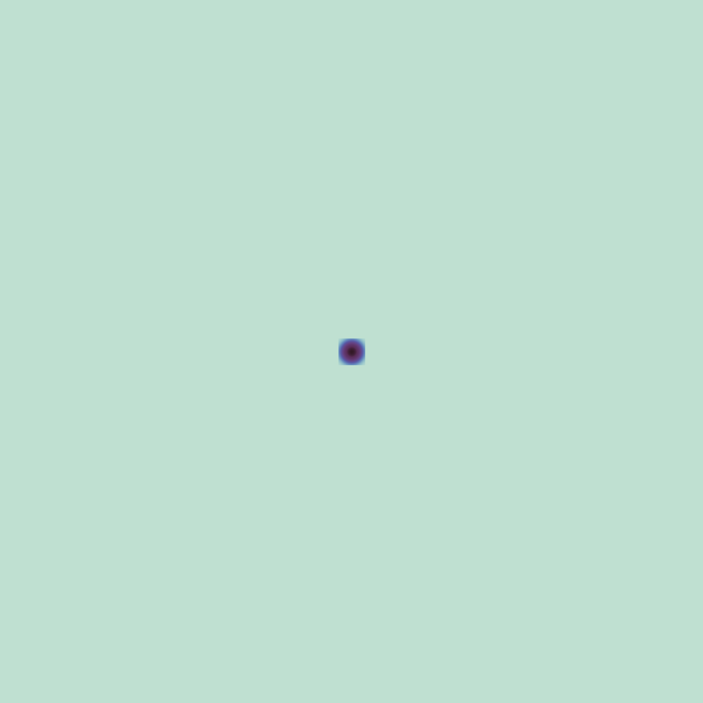
  <figcaption>Test 9 — Gaussian PSF applied. Total counts conserved; processed image is wider than raw.</figcaption>
</figure>

---

### Test 10 — Poisson noise reproducibility

Applies Poisson noise with a fixed `noise_seed`. Two runs with the same seed must produce
identical processed counts. A run with a different seed must differ.

<figure markdown>
  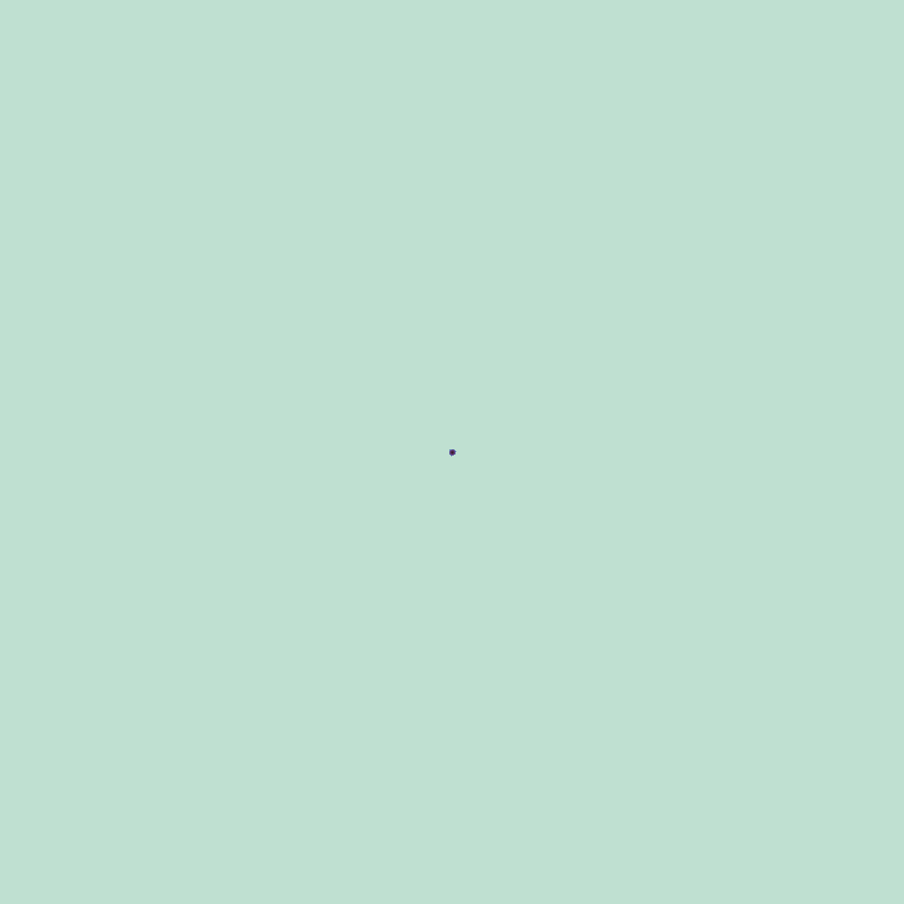
  <figcaption>Test 10 — Poisson noise, seed 42. The check is determinism: seed 42 produces bit-identical output across runs; seed 99 differs.</figcaption>
</figure>

---

### Test 11 — Exponential / TNSA energy spectrum

A pencil source with `temperature_MeV = 3.0` and `cutoff_MeV = 40.0` in zero field. Checks:

- All impact energies ≤ cutoff (hard cutoff enforced)
- Mean KE within 20% of T (correct exponential shape)
- Significant energy spread (std/mean > 0.3)

<figure markdown>
  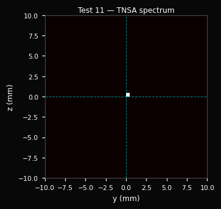
  <figcaption>Test 11 — TNSA exponential spectrum, zero field. 3mm parallel display beam; the physics check is on the KE distribution confirming exponential shape and hard cutoff. 30 mm display detector.</figcaption>
</figure>

---

### Test 12 — Relativistic energy conservation at 60 MeV

At 60 MeV, γ ≈ 1.064. Wrong momentum initialisation (KE = ½mv² instead of u = γv)
would give an impact KE of ~58.17 MeV — a 1.8 MeV shortfall. Checks mean(KE) = 60.000 ±
0.1 MeV and std/mean < 10⁻⁴.

<figure markdown>
  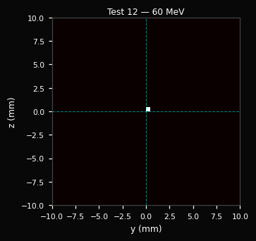
  <figcaption>Test 12 — 60 MeV, zero field. 3mm parallel display beam; exit KE = 60.000 MeV confirms correct relativistic u = γv momentum initialisation. 30 mm display detector.</figcaption>
</figure>

---

### Test 13 — Tilted detector geometry

A pencil beam aimed at a detector tilted 30° from the beam axis. In zero field, protons must
hit the detector at the geometrically expected position given the Gram-Schmidt basis construction.

Checks: ≥ 1000 hits; mean hit within 5 mm of analytic projection; energy conservation
std/mean < 10⁻⁴.

<figure markdown>
  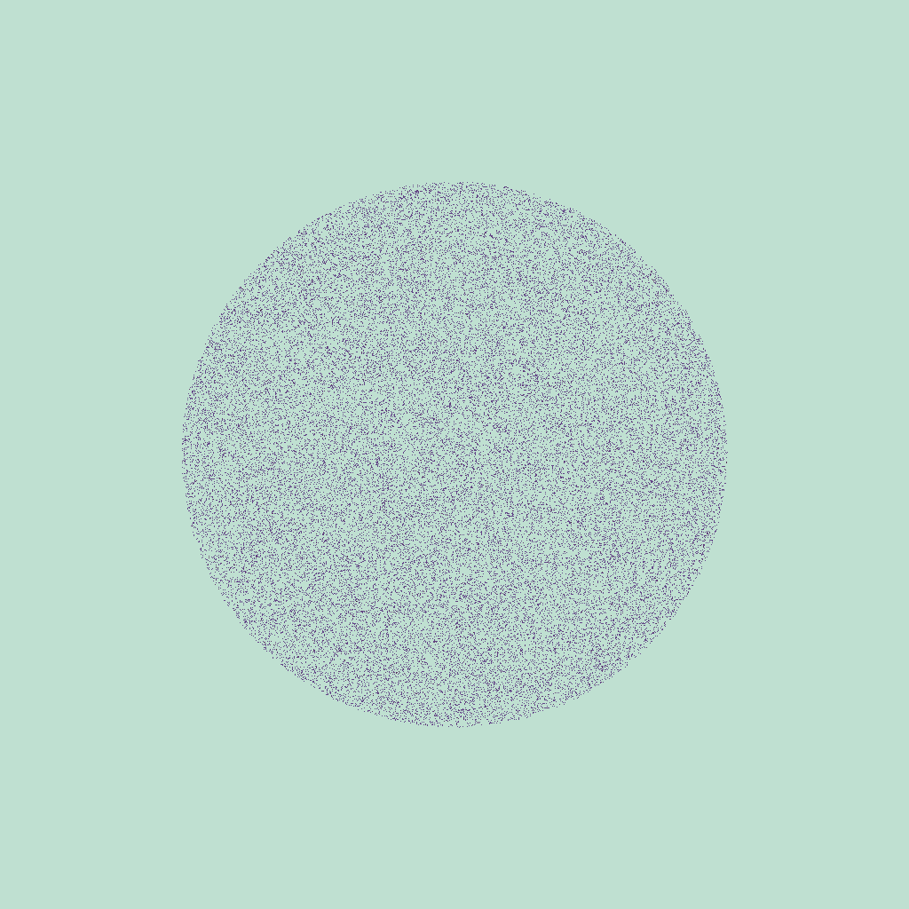
  <figcaption>Test 13 — 30° tilted detector. The oblique illumination pattern confirms correct plane-intersection and basis projection for arbitrary detector orientations.</figcaption>
</figure>

---

### Test 14 — Superimposed fields equal sum

A zero primary field plus a uniform Bz = 1 T extra field via `[[field.extra_b]]`.
Result must equal running with a standalone Bz = 1 T field: same deflection, same
energy conservation (std/mean < 10⁻⁴).

Result: std/mean = 6.5 × 10⁻⁸.

<figure markdown>
  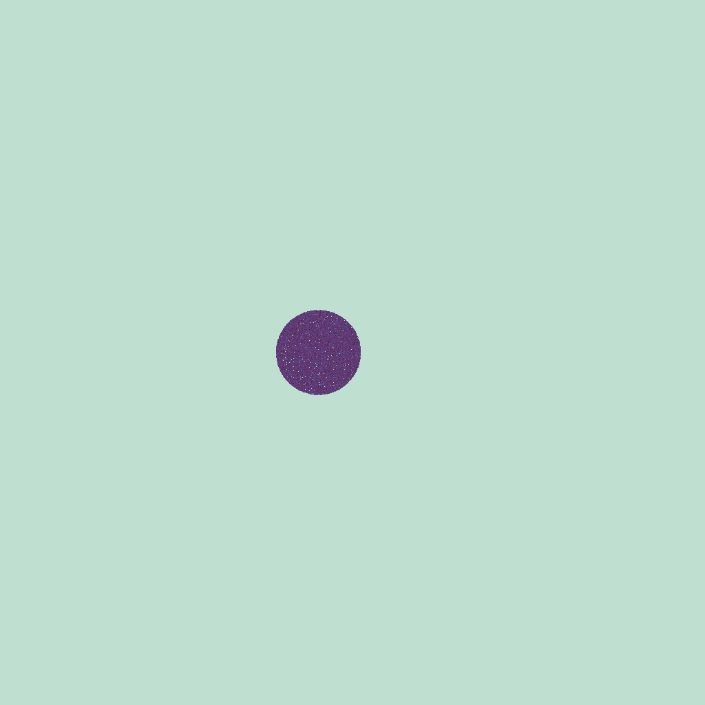
  <figcaption>Test 14 — composite field (zero primary + Bz extra). Deflection matches the standalone Bz run; energy conservation is exact.</figcaption>
</figure>

---

### Test 15 — Adaptive dt matches fixed dt

Pencil beam in uniform Bz = 1 T. Fixed dt = 1.0 ps vs adaptive (dt_large ≈ 1 ns in vacuum,
dt_small ≈ 1 ps in field). Mean y-deflection must agree to within 1 mm.

Result: Δmean_y = 0.73 mm at ≈ 20× speedup.

<div class="radiograph-gallery">
  <figure>
    
    <figcaption><strong>Fixed dt</strong> — 1.0 ps throughout</figcaption>
  </figure>
  <figure>
    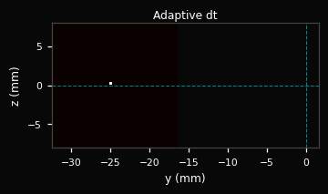
    <figcaption><strong>Adaptive dt</strong> — large in vacuum, small in field</figcaption>
  </figure>
</div>

Spot positions are visually identical; the 0.73 mm difference is sub-pixel at this scale.

---

### Test 16 — Bethe-Bloch energy loss

Pencil beam through a 1 mm water slab (ρ = 1 g/cm³). Mean exit KE compared to the
analytic CSDA integral of the same Bethe-Bloch formula used by the GPU.

Checks: mean exit KE within 5% of analytic; no particle gains energy.

Result: simulation 10.868 MeV vs analytic 10.944 MeV — relative error 0.7%.

<figure markdown>
  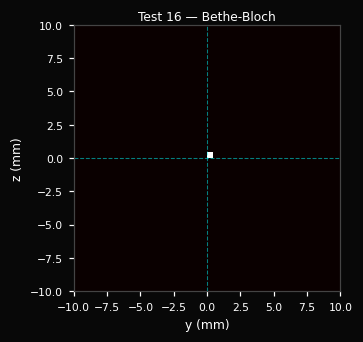
  <figcaption>Test 16 — 3mm parallel beam through 1 mm water slab. Exit KE = 10.87 MeV vs analytic 10.94 MeV (0.7% error). 30 mm display detector.</figcaption>
</figure>

---

### Test 17 — Analytic straight-line hit

**Motivation:** The arbitrary-geometry detector introduces a Gram-Schmidt basis construction
and a ray–plane intersection. A sign flip or transposed basis would produce systematically
wrong hit coordinates without any physics being broken.

**Setup:** Pencil beam from (−100, +20, −15) mm aimed at (0, +35, −23) mm (no axis-aligned
direction). Zero field. Detector at (110, 0, 0) mm, 500 × 500 mm.

**Check:** Mean GPU hit within 0.1 mm of the analytic ray–plane intersection in both y and z.

Result: y diff = 0.003 mm, z diff = −0.001 mm.

<figure markdown>
  
  <figcaption>Test 17 — off-axis beam, zero field. Disk at (+51.5, −31.8) mm in detector-local coordinates, matching the analytic ray–plane intersection to 0.003 mm. 8mm parallel display beam, 150×100 mm detector — spot is deliberately far off-centre.</figcaption>
</figure>

---

### Test 18 — Larmor radius (analytic cycloid vs Boris)

**Setup:** Pencil beam at 14.7 MeV, Bz = 0.1 T uniform, 120 mm field region.

**Analytic:** r_L = p/(qB) ≈ 1.62 m. θ_exit = arcsin(L/r_L) ≈ 4.2°. Expected y at
detector: −4.82 mm.

**Check:** GPU mean y-deflection within 1% of the analytic cycloid.

Result: analytic −4.82 mm, GPU −4.82 mm, relative error 0.04%.

<figure markdown>
  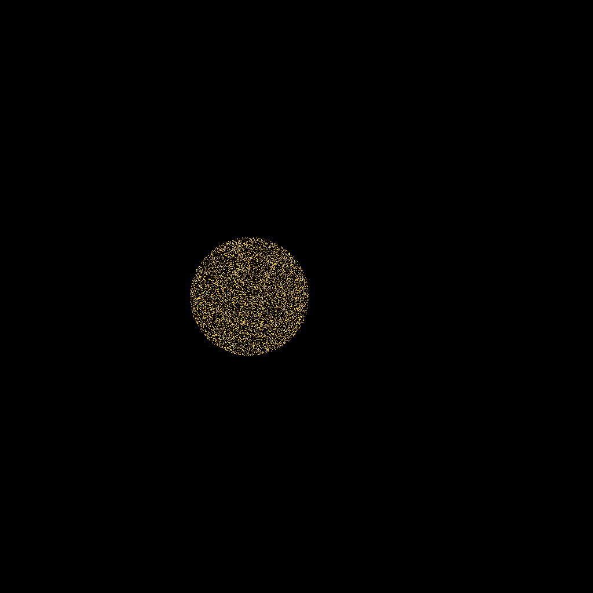
  <figcaption>Test 18 — uniform B_z = 0.1 T, 3mm parallel display beam. Disk deflected in −y, matching the analytic Larmor cycloid to 0.04%. 30 mm display detector.</figcaption>
</figure>

---

### Test 19 — E×B velocity selector

**Setup:** Bz = 0.1 T, Ey = v_beam × Bz. Two runs: `scale_E = 0` (B only) and
`scale_E = 1` (force balance).

**Checks:** B-only: mean_y < −1.0 mm. B+E: |mean_y| < 1.0 mm. Runs differ by > 1 mm.

Result: B-only mean_y = −2.37 mm; B+E mean_y = +0.11 mm.

<div class="radiograph-gallery">
  <figure>
    
    <figcaption><strong>B only</strong> — Lorentz force deflects beam to −2.37 mm. 3mm parallel display beam, 30 mm detector.</figcaption>
  </figure>
  <figure>
    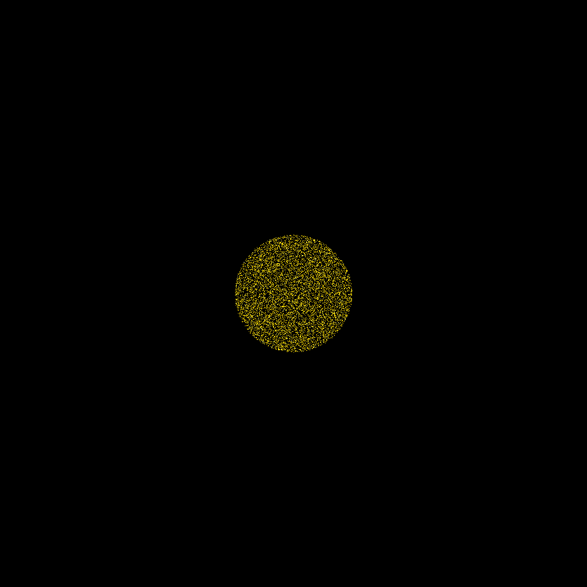
    <figcaption><strong>B + E</strong> — force balance; beam returns to centre (+0.11 mm). Same display run.</figcaption>
  </figure>
</div>

---

### Test 20 — hits.bin rebinning consistency

**Method:** Re-bin `hits.bin` (y_mm, z_mm, ke_MeV triples) in Python using the GPU pixel
formula and compare to `raw_counts.bin`.

**Checks:** Total counts match exactly; ≥ 99.5% of pixels agree within ±1 count.

Result: 99.8% pixel agreement.

<figure markdown>
  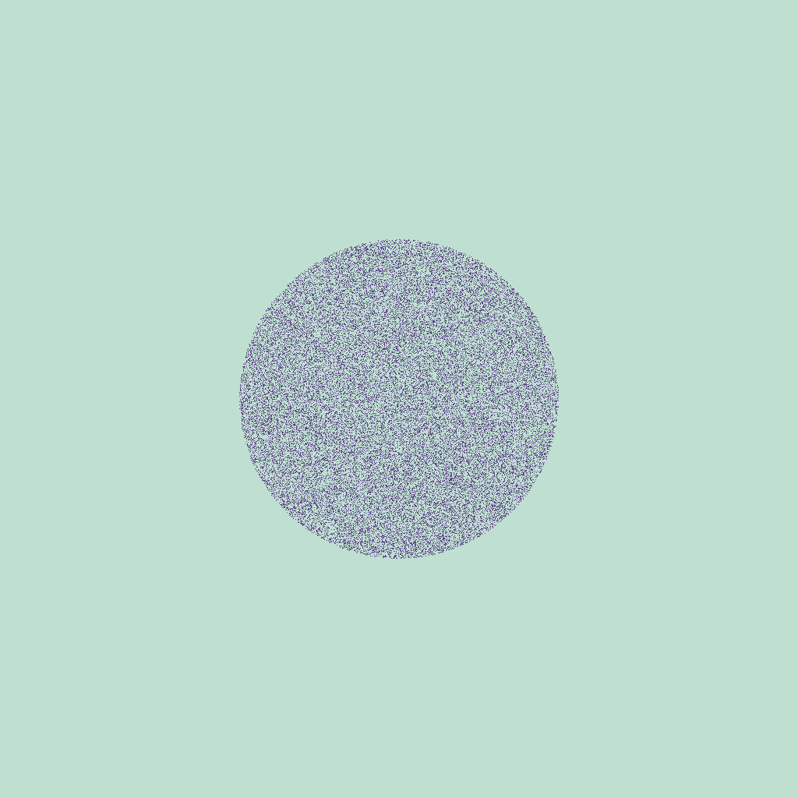
  <figcaption>Test 20 — disk source, 50 000 particles. Uniform disk footprint; the Python-rebinned histogram reproduces the GPU image to within float32 pixel-boundary rounding.</figcaption>
</figure>

---

### Test 21 — Geometry invariance

**Setup:** Uniform Bz = 0.1 T, parallel beam.

- Case A: beam along +x, detector at (110, 0, 0) mm
- Case B: beam along +y, detector at (0, 110, 0) mm, up = (−1, 0, 0)

**Check:** Both mean_y_local < 0; |mean_y_A − mean_y_B| < 0.5 mm.

Result: A = −2.37 mm, B = −2.36 mm, difference = 0.01 mm.

<div class="radiograph-gallery">
  <figure>
    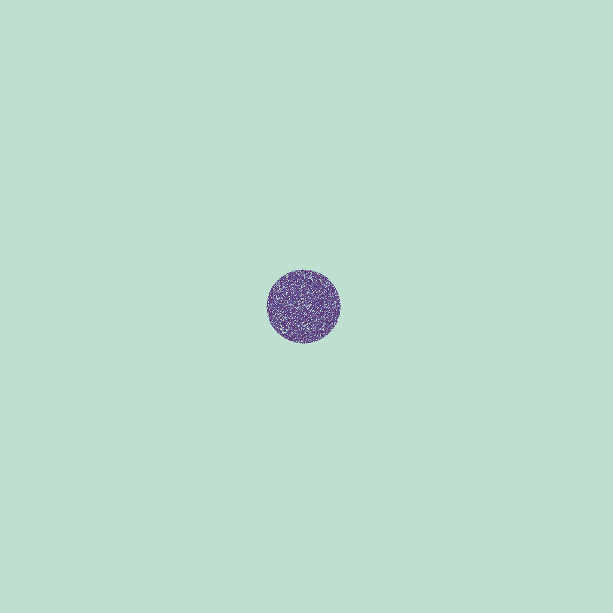
    <figcaption><strong>Case A</strong> — beam along +x; disk deflected to −2.21 mm local y</figcaption>
  </figure>
  <figure>
    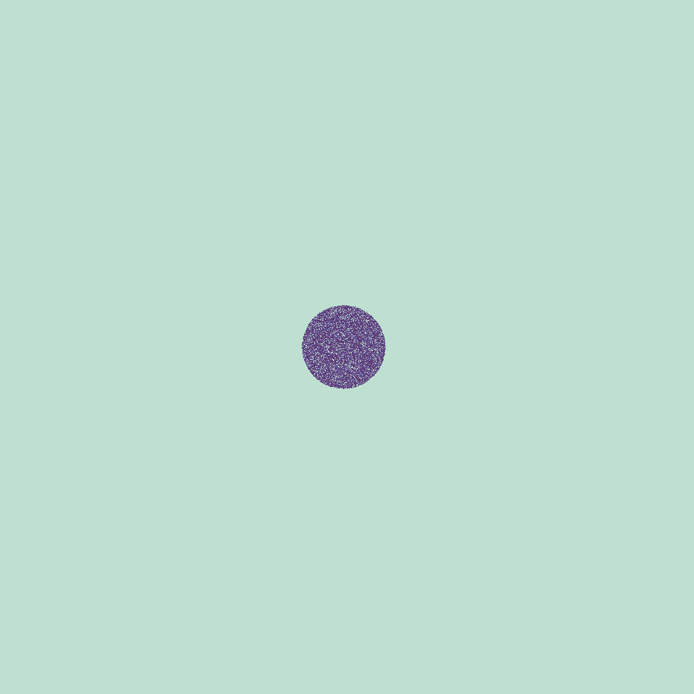
    <figcaption><strong>Case B</strong> — beam along +y; disk deflected to −2.32 mm local y</figcaption>
  </figure>
</div>

---

### Test 22 — Field compositing linearity

**Setup:** Three runs with a zero primary field and `[[field.extra_b]]` entries:

- **A:** extra Bz = 0.1 T → deflects −y only
- **B:** extra By = 0.1 T → deflects +z only
- **C:** both Bz and By → must satisfy y_C ≈ y_A and z_C ≈ z_B

**Checks:** Correct signs; superposition cross-coupling < 5% in each channel.

Result: y channel error 0.0%; z channel error 0.0%.

<div class="radiograph-gallery">
  <figure>
    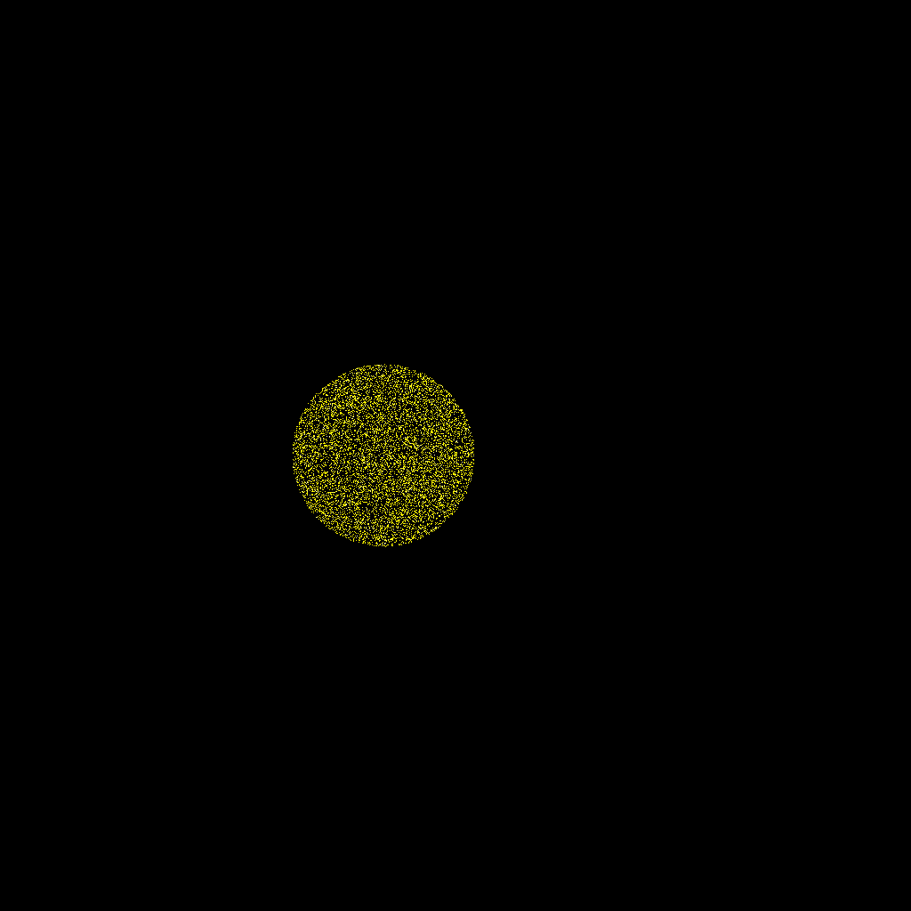
    <figcaption><strong>Bz only</strong> — deflects in −y. 3mm parallel display beam, 30 mm detector.</figcaption>
  </figure>
  <figure>
    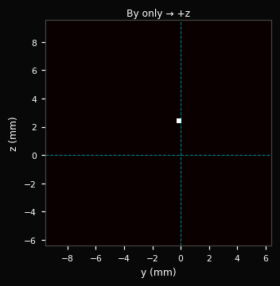
    <figcaption><strong>By only</strong> — deflects in +z. Same display setup.</figcaption>
  </figure>
  <figure>
    
    <figcaption><strong>Bz + By</strong> — diagonal deflection; channels independent.</figcaption>
  </figure>
</div>

---

### Test 23 — Density scaling (ΔE ∝ ρL; ρL equivalence)

Three water slabs with matched and mismatched column depths:

| Slab | Thickness | Density | ρL |
|------|-----------|---------|-----|
| A | 1 mm | 1 g/cm³ | 0.1 g/cm² |
| B | 2 mm | 1 g/cm³ | 0.2 g/cm² |
| C | 1 mm | 2 g/cm³ | 0.2 g/cm² |

Slabs B and C have equal ρL and must produce equal energy loss (ρL equivalence, exact in CSDA).

**Checks:** Each slab within 5% of analytic CSDA integral; |ΔE_C − ΔE_B| / ΔE_B < 3%.

Result: B vs C relative difference = 0.08%.

<div class="radiograph-gallery">
  <figure>
    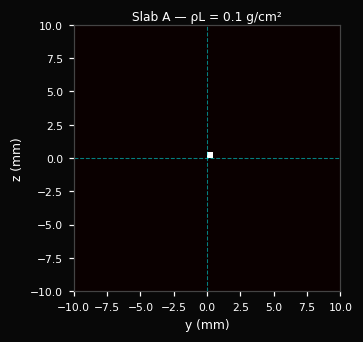
    <figcaption><strong>Slab A</strong> — 1 mm, ρ = 1 g/cm³ (ρL = 0.1 g/cm²). 3mm parallel display beam. Brighter = more energy remaining.</figcaption>
  </figure>
  <figure>
    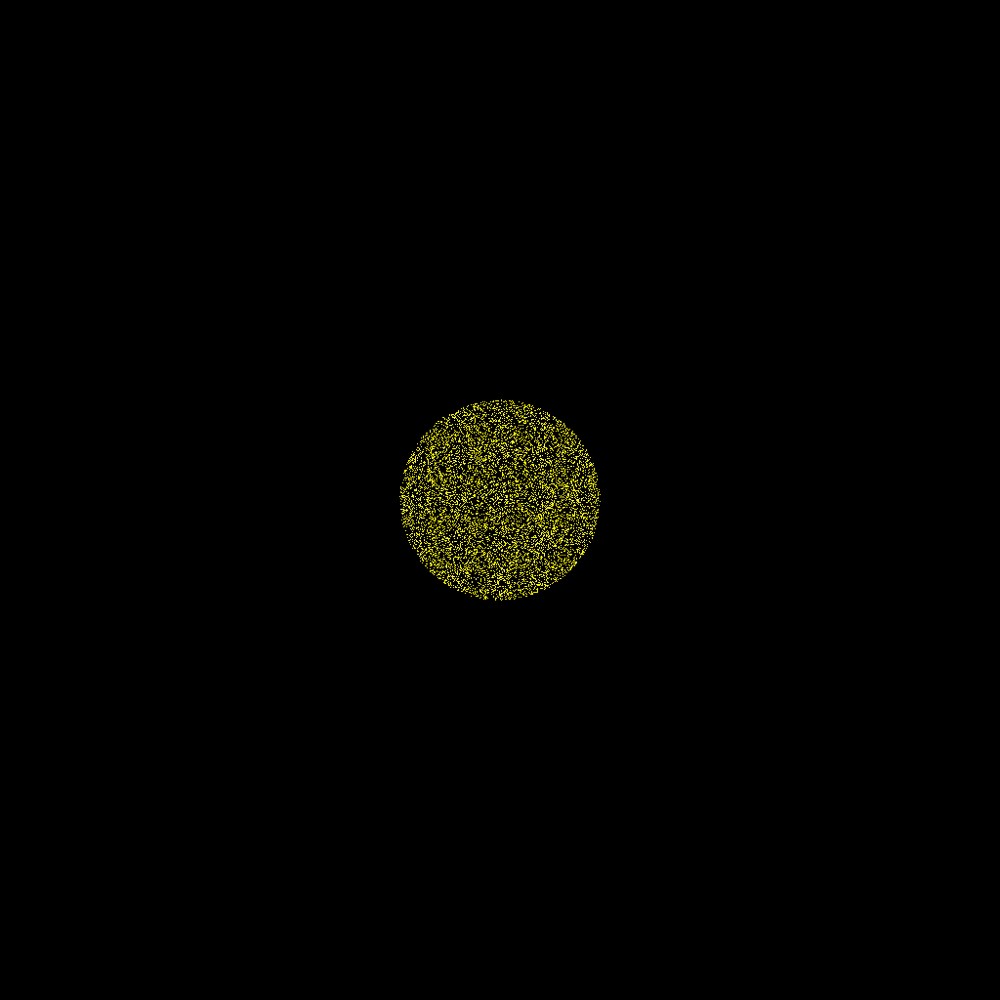
    <figcaption><strong>Slab B</strong> — 2 mm, ρ = 1 g/cm³ (ρL = 0.2 g/cm²). Dimmer = more energy lost.</figcaption>
  </figure>
  <figure>
    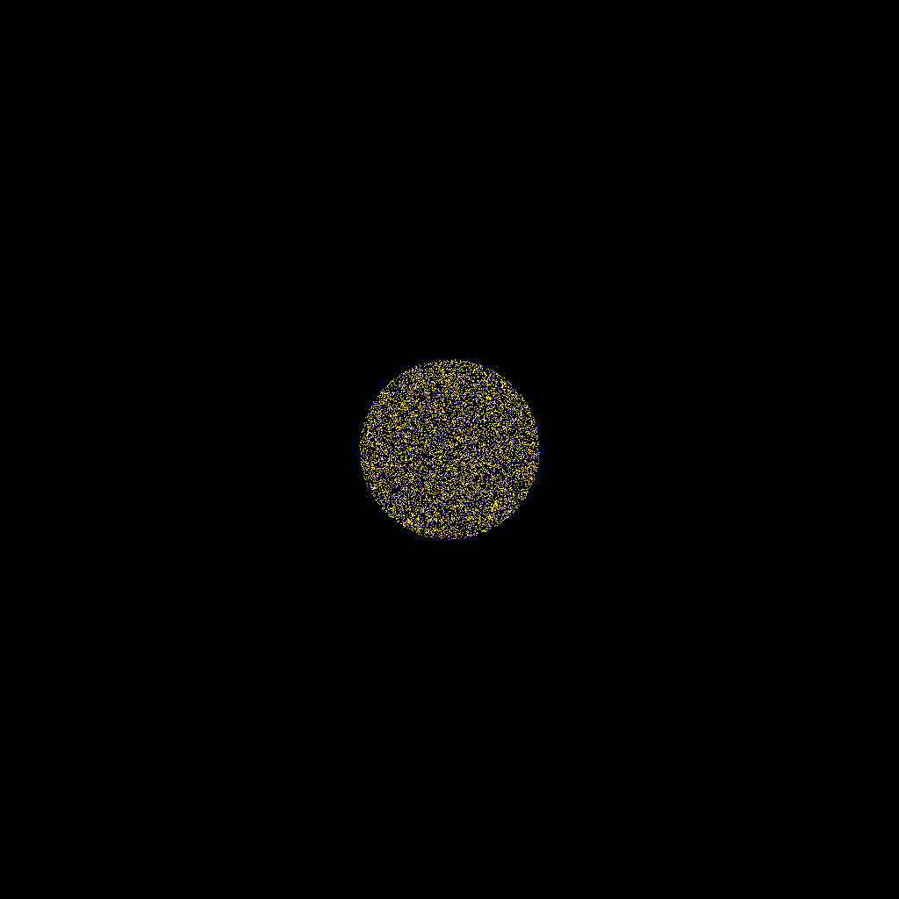
    <figcaption><strong>Slab C</strong> — 1 mm, ρ = 2 g/cm³ (ρL = 0.2 g/cm²). Identical to B — same ρL, same loss.</figcaption>
  </figure>
</div>

Slabs B and C produce the same radiograph: same ρL → same energy loss → same spot brightness.

---

### Test 24 — Vacuum regression

TOML deck with Bz = 1 T, no `[density]` block. The Bethe-Bloch GPU path must be a complete
no-op: std(KE) / mean(KE) < 10⁻⁴.

Result: std/mean = 0.00 × 10⁰ — exact conservation, bit-identical across all 20 000 particles.

<figure markdown>
  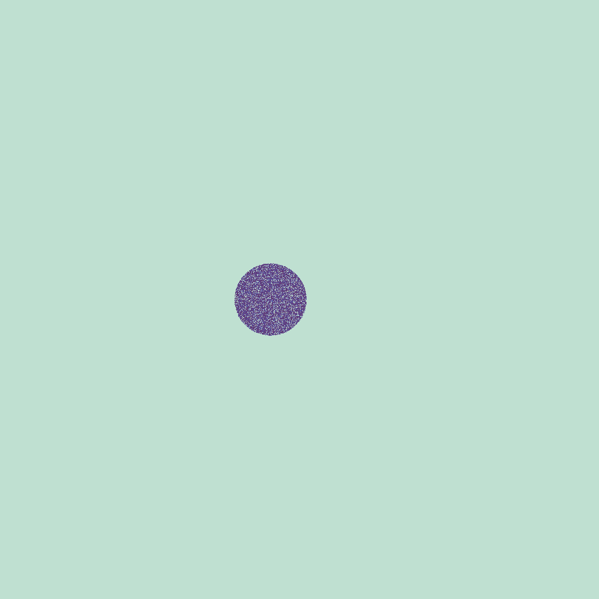
  <figcaption>Test 24 — parallel beam, Bz = 1 T, no density block. Deflected spot; exit KE exactly equals input energy confirming the Bethe-Bloch path is inactive in vacuum.</figcaption>
</figure>

---

### Test 25 — Binary opaque absorber

A dense slab (ρ = 5 g/cm³, 10 mm thick) with `mode = "opaque"` and threshold 0.1 g/cm³
must absorb every particle — zero detector hits, all N counted as absorbed in
`metadata.json → diagnostics.n_absorbed`. A second run with a thin slab (ρ = 0.001 g/cm³,
CSDA mode) must produce hits, confirming the code path is inactive at low density.

**Result:** 0 hits / N absorbed (opaque run); hits > 0 (CSDA run). Both pass.

The radiograph below shows the opaque absorber applied to a shaped mask — a wire mesh
(5 mm pitch, 1 mm wires) placed upstream of a z-pinch field. Left: undeflected reference
grid (no field). Right: grid distorted by the integrated z-pinch B field. This reproduces
the experimental fiducial mesh technique used on real RCF detectors.

<figure markdown>
  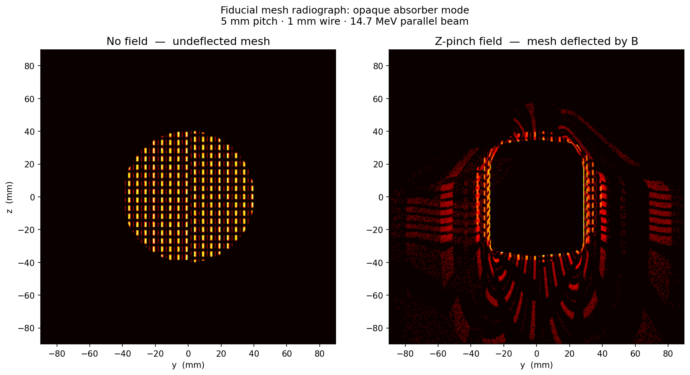
  <figcaption>Test 25 — opaque absorber mode. Left: 5 mm wire mesh, no field — regular grid shadow. Right: same mesh through z-pinch field — grid deflected by path-integrated B, revealing the pinch structure. 1M particles, 14.7 MeV parallel beam.</figcaption>
</figure>

---

## Tolerances

| Test(s) | Quantity | Tolerance | Rationale |
|---------|---------|-----------|-----------|
| 4, 14, 15, 24 | KE std/mean | < 10⁻⁴ | Magnetic force does no work; Boris rotation is energy-exact |
| 2 | Zero-field centring | < 1 mm | Straight-line projection; systematic error only |
| 3 | E-field magnitude | within 3× analytic | Covers relativistic correction; sign is exact |
| 7 | Disk spread | < 10% of magnified radius | Geometric magnification |
| 13 | Tilted hit position | < 5 mm | Gram-Schmidt projection at 30° tilt |
| 15 | Adaptive vs fixed Δmean_y | < 1 mm | Orbit is the same; only vacuum transit dt differs |
| 16 | Bethe-Bloch exit KE | < 5% relative | Discretisation at 0.5 ps → ~26 µm/step; converges with smaller dt |
| 17 | Ray–plane hit position | < 0.1 mm | Sub-pixel; pencil beam → zero spread |
| 18 | Larmor radius deflection | < 1% relative | Integrator accumulation over 120 mm field transit |
| 19 | E×B force balance | \|mean_y\| < 1 mm | Force cancellation; 1 mm is 40% of the B-only deflection |
| 20 | Rebinning agreement | ≥ 99.5% pixels within ±1 | float32 boundary rounding at pixel edges |
| 21 | Geometry invariance | < 0.5 mm difference | World-frame rotation; same B magnitude |
| 22 | Compositing cross-coupling | < 5% relative | Expected cross-coupling ~0.02% at these parameters |
| 23 | Individual ΔE vs analytic | < 5% relative | Same discretisation as test 16 |
| 23 | ρL equivalence | < 3% relative | Should be exact in CSDA; tolerance covers timestep discretisation |
| 25 | Opaque: hits | == 0 | All particles absorbed before reaching detector |
| 25 | Opaque: n_absorbed | == N | Completion counter must equal particle count |
| 25 | CSDA thin slab: hits | > 0 | Low-density slab must be transparent |

---

## What is not validated

- GPU numerical precision differences across hardware
- Multi-species or non-proton particles
- Energy-loss straggling (CSDA gives mean loss only; Landau-Vavilov fluctuations are not modelled)
- Comparison against experimental shot data
- MoltenVK-specific behaviour on non-Apple Silicon hardware
- Nuclear stopping (below ~1 MeV proton energy)
